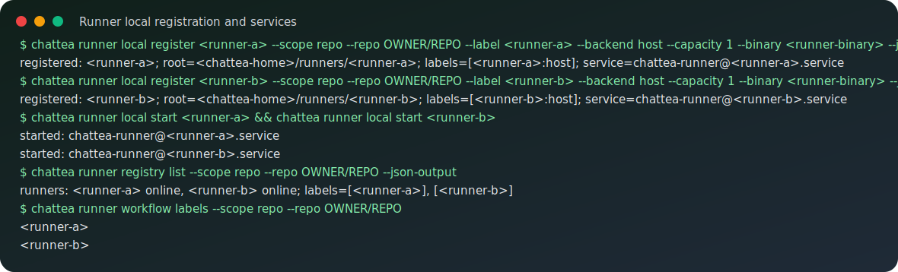
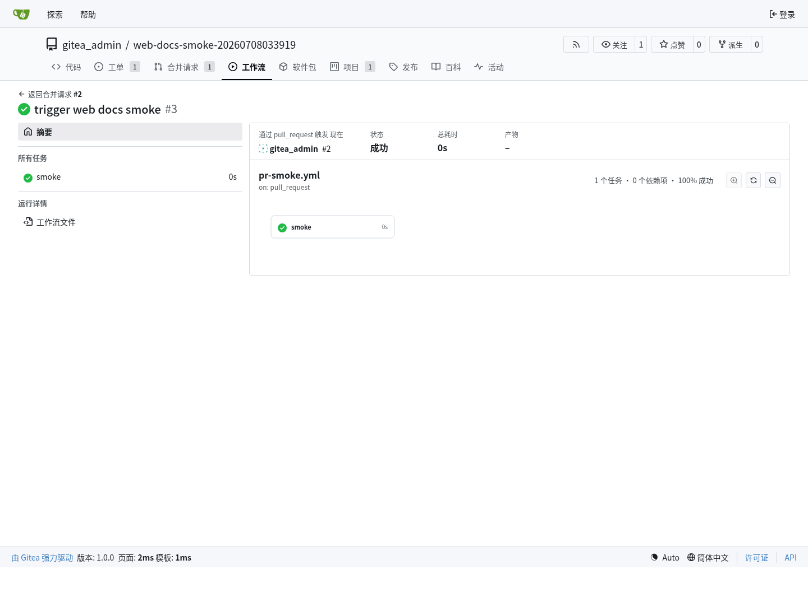
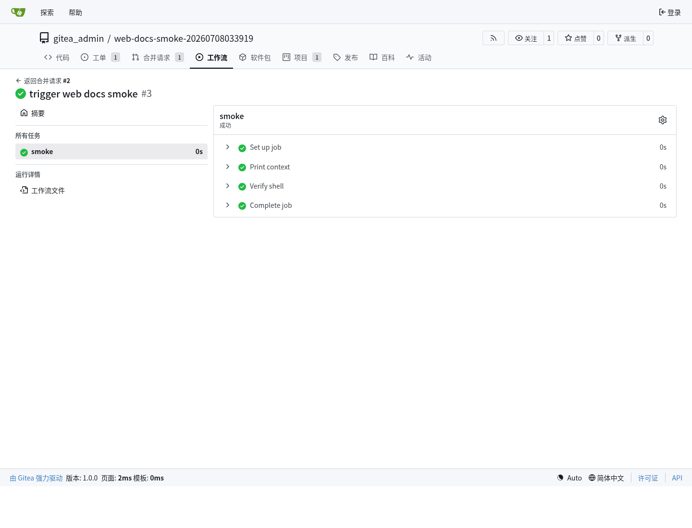
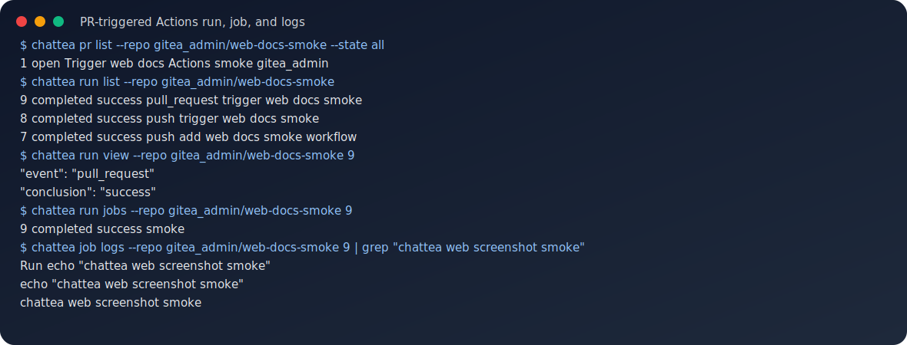

# Actions / Flow（动作 / 流程）快速开始

这篇文档记录 ChatTea 已实际跑通过的 Actions / Flow 流程。验收链路是：启用 Actions，注册运行器，推送工作流文件，通过 PR 触发工作流，查看 run/job，并读取日志。本文只写已经有实际命令和截图证据的内容。

## CLI 能力面

```text
chattea runner                # 管理 Gitea Actions 运行器
├── registry                  # 管理 Gitea 服务器侧 runner 记录
├── local                     # 管理本机 runner instances、root、config 和 service
├── pool                      # 批量管理同机多个 runner
└── workflow                  # 检查 workflow runs-on 和 runner labels

chattea run                   # 查看和控制 workflow run
├── list                      # 列出 run
├── view                      # 查看 run 详情
├── jobs                      # 列出 run 下的 jobs
├── logs                      # 汇总 run 下的 job logs
├── rerun                     # 重跑 run
├── rerun-failed              # 只重跑失败 jobs
└── delete                    # 删除 run

chattea job                   # 查看和重跑 job
├── view                      # 查看 job 详情
├── logs                      # 读取 job 日志
└── rerun                     # 重跑 job

chattea artifact              # 查看和下载 Actions 产物
├── list                      # 列出产物
├── view                      # 查看产物详情
├── download                  # 下载产物 zip
└── delete                    # 删除产物
```

## REST API 映射

```text
chattea runner registry token  -> POST /repos/{owner}/{repo}/actions/runners/registration-token
chattea runner registry list   -> GET /repos/{owner}/{repo}/actions/runners
chattea runner registry view   -> GET /repos/{owner}/{repo}/actions/runners/{runner_id}
chattea runner registry enable -> PATCH /repos/{owner}/{repo}/actions/runners/{runner_id}
chattea runner registry disable -> PATCH /repos/{owner}/{repo}/actions/runners/{runner_id}
chattea runner registry delete -> DELETE /repos/{owner}/{repo}/actions/runners/{runner_id}

chattea run list           -> GET /repos/{owner}/{repo}/actions/runs
chattea run view           -> GET /repos/{owner}/{repo}/actions/runs/{run}
chattea run jobs           -> GET /repos/{owner}/{repo}/actions/runs/{run}/jobs
chattea run logs           -> 聚合 run jobs 和 job logs 的本地辅助函数
chattea run rerun          -> POST /repos/{owner}/{repo}/actions/runs/{run}/rerun
chattea run rerun-failed   -> POST /repos/{owner}/{repo}/actions/runs/{run}/rerun-failed-jobs
chattea run delete         -> DELETE /repos/{owner}/{repo}/actions/runs/{run}

chattea job view           -> GET /repos/{owner}/{repo}/actions/jobs/{job_id}
chattea job logs           -> GET /repos/{owner}/{repo}/actions/jobs/{job_id}/logs
chattea job rerun          -> POST /repos/{owner}/{repo}/actions/runs/{run}/jobs/{job_id}/rerun

chattea artifact list      -> GET /repos/{owner}/{repo}/actions/artifacts
chattea artifact download  -> GET /repos/{owner}/{repo}/actions/artifacts/{artifact_id}/zip
chattea artifact delete    -> DELETE /repos/{owner}/{repo}/actions/artifacts/{artifact_id}
```

`runner local` 系列命令是本地系统辅助函数：安装或定位 `gitea-runner`，在每个 runner root 下写运行器配置，用 Gitea 注册令牌注册运行器，并管理对应的用户级 systemd 服务。

## Actions 文件视角

Actions 本身跨三层状态：

```text
Gitea database:
  workflow run、job、artifact metadata、runner registry。

Gitea repository:
  .gitea/workflows/*.yml 保存 workflow 定义。

Runner root:
  config、.runner 身份、workdir 和 job 执行现场。
```

从运行链路看：

```text
push / pull_request
  -> Gitea 读取仓库里的 .gitea/workflows/*.yml
  -> Gitea 在数据库里创建 run / job
  -> 匹配 scope + label 的 runner 领取 job
  -> runner 在 <runner-root>/work/<task-id>/hostexecutor 执行步骤
  -> job 日志、状态和 artifacts 回传给 Gitea
```

如果 workflow 用来发布 Pages，则最后一步是调用 Pages 发布命令，把构建产物从 runner workdir 发布到 `<chattea-home>/pages/sites/<owner>/<repo>/`。完整运行时文件边界见 [ChatTea 运行时文件系统与服务边界](runtime-filesystem-layout.md)，Pages 发布流见 [Gitea Pages 机制与静态站点发布](gitea-pages.md)。

## 运行器配置和运行环境

一次运行器注册至少涉及四类本地状态：

```text
<runner-root>/bin/gitea-runner          # 运行器二进制文件
<runner-root>/config/config.yaml        # 运行器配置
<runner-root>/.runner                   # 注册后的本地 runner 身份文件，敏感，不提交
<runner-root>/work/                     # host 后端执行 job 的工作目录父目录
```

实践中生成的 `config.yaml` 关键字段如下：

```yaml
runner:
  file: .runner
  capacity: 1
  timeout: 3h
  labels:
    - "<runner-label>:host"
cache:
  enabled: false
host:
  workdir_parent: <runner-root>/work
```

这里的 `capacity: 1` 表示单个 runner daemon 同时只接一个 job。要在同一台机器、同一 Unix 用户下并发跑多个 job，实践路径是启动多个 runner root，每个 root 有自己的 `.runner`、`config.yaml` 和 `work/`。本轮真实实践注册了两个 repo-scope runner，它们分别使用不同 label 和不同 root；同一个 workflow 里的两个 job 几乎同时开始，并都成功完成。

`runner local start <runner-name>` 会生成并启动 `chattea-runner@<runner-name>.service`。因此长期维护多个 runner 时，每个 runner 都有独立 root、独立配置、独立 service 和独立 workdir。

## Host 后端和 Docker

实践使用的是 host 后端，不依赖 Docker。注册 label 时写成：

```text
<runner-label>:host
```

workflow 中引用时只写冒号前的 label：

```yaml
runs-on: <runner-label>
```

host 后端下，job 以启动 runner daemon 的同一 Unix 用户执行，工作目录位于 `host.workdir_parent` 下。它适合本机可信任务和内网开发验证；如果执行不可信 workflow，需要额外隔离策略。

## Scope：repo、user、org、admin

Gitea runner 注册令牌支持四种 scope。ChatTea CLI 暴露为 `chattea runner registry token --scope ...` 和 `chattea runner local register --scope ...`。

| Scope | 注册命令形态 | 本轮实践结果 |
| --- | --- | --- |
| repo | `--scope repo --repo OWNER/REPO` | 两个 repo-scope host runner 被同一个 PR workflow 的两个 job 分别调用，pull_request run 成功 |
| user | `--scope user` | user-scope host runner 被用户仓库 workflow 调用，push run 成功 |
| org | `--scope org --org ORG` | org-scope host runner 被组织仓库 workflow 调用，push run 成功 |
| admin | `--scope admin` | admin-scope host runner 被仓库 workflow 调用，push run 成功 |

实践结论：workflow 是否能调用 runner，核心取决于 runner 的 scope 是否覆盖该仓库，以及 workflow 的 `runs-on` 是否匹配 runner 注册 label。

## 运行器设置

运行工作流前，先在 ChatTea 管理的开发 Gitea 服务上启用 Actions：

```bash
chattea server config set --section actions --key ENABLED --value true -I
chattea server restart
chattea server health
```

安装并注册仓库级运行器：

```bash
chattea runner local install demo --force
chattea runner local register demo --scope repo --repo gitea_admin/demo --label ubuntu-latest --backend host
chattea runner local start demo
chattea runner local status demo
chattea runner registry list --scope repo --repo gitea_admin/demo
```

运行器设置和维护命令已经在本地 Gitea 实例上实际运行，并保留了脱敏记录：



每个本机 runner 实例使用独立 root：

```text
<chattea-home>/runners/<runner-name>/bin/gitea-runner
<chattea-home>/runners/<runner-name>/config/config.yaml
<chattea-home>/runners/<runner-name>/work
```

默认标签使用 host 后端：

```text
ubuntu-latest:host
```

这样第一轮真实实践不依赖 Docker 镜像拉取。

## PR 触发工作流

已实践的最小工作流放在 `.gitea/workflows/pr-practice.yml`：

```yaml
name: ChatTea PR Practice
on:
  pull_request:
  push:
jobs:
  practice:
    runs-on: ubuntu-latest
    steps:
      - name: Print context
        run: |
          echo "chattea actions practice"
          echo "event=$GITHUB_EVENT_NAME"
          echo "repo=$GITHUB_REPOSITORY"
      - name: Verify shell
        run: |
          pwd
          echo "ok" > practice-result.txt
          cat practice-result.txt
```

推送 feature 分支并打开 PR 后，用下面命令检查 run：

```bash
chattea run list --repo gitea_admin/demo
chattea run view --repo gitea_admin/demo <run-id>
chattea run jobs --repo gitea_admin/demo <run-id>
chattea job logs --repo gitea_admin/demo <job-id>
```

对应的 Gitea Web 页面和 CLI 日志读取都已经实际验证：







## 已验证的本地实践结果

开发服务器上的真实实践覆盖了两组结果。

第一组验证 repo-scope 多 runner 并发和 PR 触发：

```text
scope: repo
runner count: 2
runner backend: host
runner capacity: 1 per daemon
workflow event: pull_request
workflow jobs: runner_a, runner_b
runs-on: <runner-label-a>, <runner-label-b>
job result: both completed successfully
job start: two jobs started within about one second
```

第二组验证 scope 覆盖范围：

```text
user-scope runner -> user-owned repo push workflow -> success
org-scope runner  -> org-owned repo push workflow  -> success
admin-scope runner -> repo push workflow           -> success
```

实践注意：推送新分支后立刻创建 PR，可能和 Gitea 分支可见性刷新产生竞态。如果刚 push 后创建 PR 返回 `404`，短暂等待后用同一个 `head=<feature-branch>` 请求载荷重试即可。
