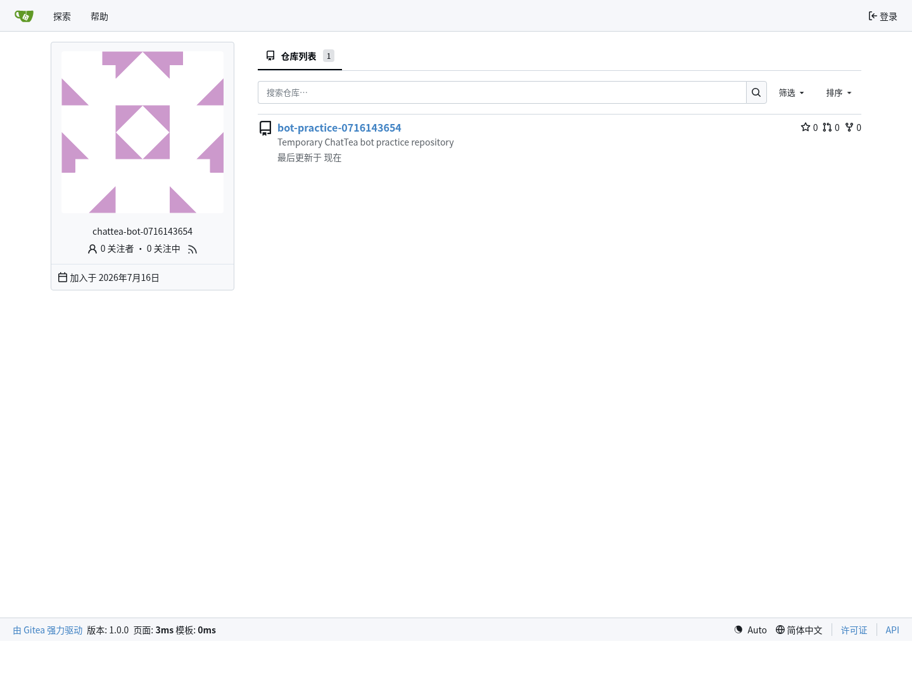
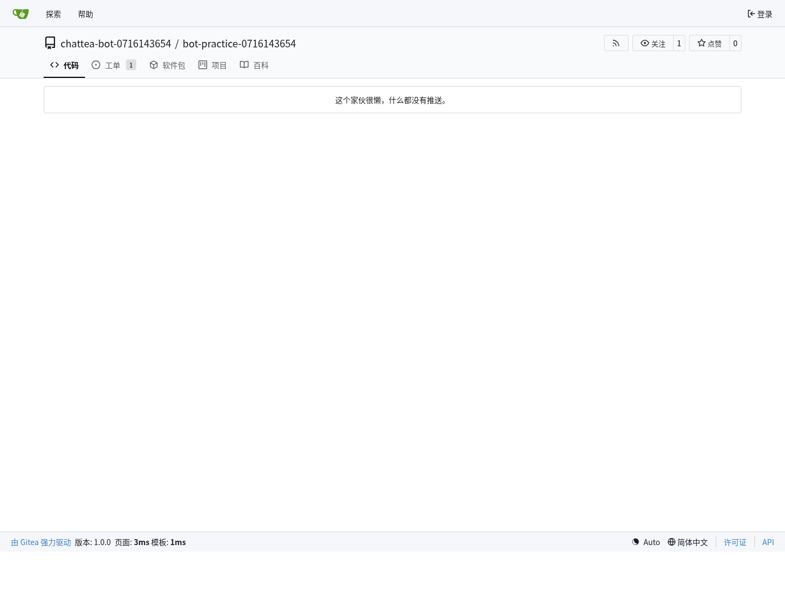
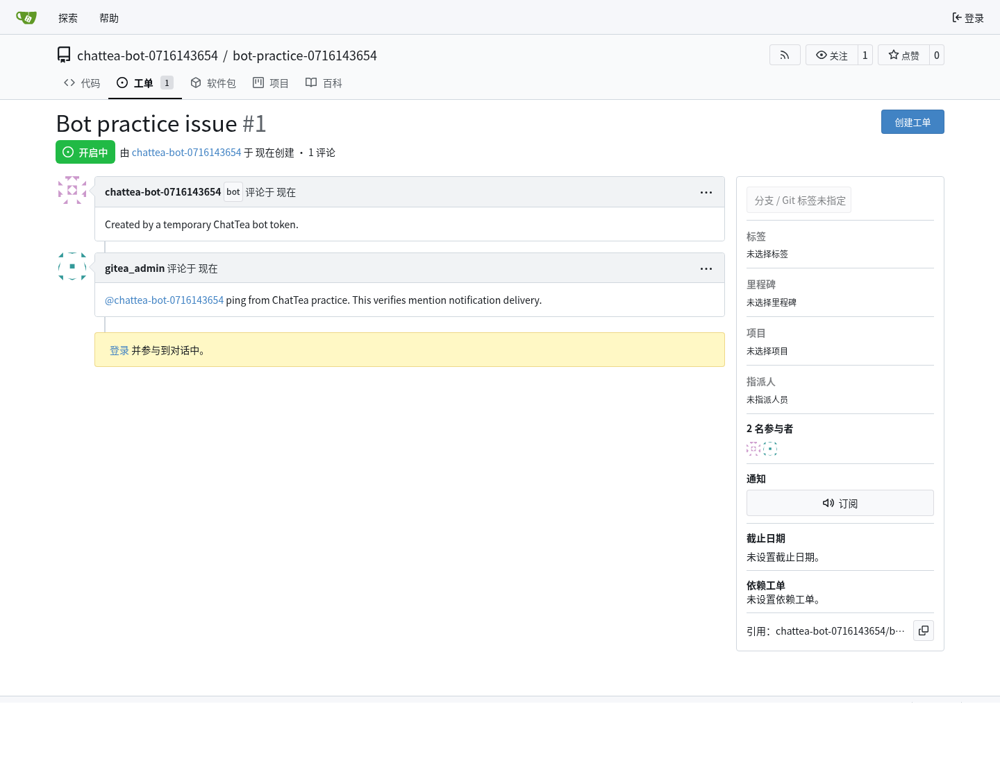

# 机器人账号与服务账号

本文记录 Gitea 机器人账号能力、典型用途、交互模式、唤醒机制，以及 ChatTea 第一版 `bot` CLI 的真实实践结果。这里的“机器人”不是 Actions runner，而是一个用于自动化调用 Gitea API、Git over HTTPS、CI/CD 或仓库维护任务的账号主体。

## 一句话结论

Gitea 已经有底层 bot 用户类型，本机 admin CLI 可以创建真正的 bot；但稳定 REST API 还没有完整暴露 bot 管理能力。所以 ChatTea 第一版先做 **本机托管 Gitea 的 local backend**，通过 `gitea admin user create --user-type bot` 创建 bot，再用 bot token 做真实 API 操作。

## Bot 能做什么

Bot 本质上是一个非交互式账号身份。它能做什么取决于三层条件：

1. **账号类型**：Gitea 的 `UserTypeBot` 不能像普通用户那样用密码登录 UI；它适合自动化，不适合人工交互。
2. **token scope**：token 需要包含对应 API scope，例如 `write:issue`、`write:repository`、`write:notification`。
3. **仓库 / 组织权限**：即使 token scope 足够，也仍需要账号对目标仓库或组织有访问权限。

在这些条件满足时，bot 可以承担这些职责：

- 创建、读取、评论 issue / PR；
- 做 PR review、状态回写、自动标签、自动分派；
- 创建 release、上传或管理发布附件；
- 以固定身份执行仓库维护任务，例如同步、迁移、镜像、生成文档；
- 用 Git over HTTPS 进行自动化 push / fetch；
- 读取自己的通知流，响应别人 `@bot` 的请求；
- 作为外部 bot 服务调用 Gitea API 的身份。

Bot 不等于一个常驻进程。账号只是身份；真正“干活”的是外部进程、定时任务、webhook receiver、Actions job 或 ChatTea CLI。

## 主要用途

| 用途 | 说明 |
| --- | --- |
| Release bot | 创建 tag / release、补 changelog、上传发布附件 |
| Issue triage bot | 根据评论或标签自动分派、补标签、关闭重复问题 |
| PR assistant | 自动 review、跑检查后回写评论或状态 |
| Docs bot | 文档生成、截图更新、文档 PR 自动同步 |
| Mirror / sync bot | 在 Gitea 和外部 Git 服务之间同步仓库 |
| ChatOps bot | 监听 `@bot` 指令，然后调用 Gitea API 执行动作 |
| CI service account | 给外部 CI/CD 使用固定 Gitea 身份，而不是复用个人账号 |

## 交互模式

### 1. CLI 管理模式

管理员在本机托管 Gitea 上创建 bot 和 token：

```bash
chattea bot plan
chattea bot create \
  --username release-bot \
  --email release-bot@example.invalid \
  --token-name release-bot \
  --scope write:user,write:repository,write:issue,write:notification
chattea bot token create release-bot --token-name release-bot-next
```

这类命令负责账号和 token 生命周期，不负责长期运行 bot 逻辑。

### 2. 轮询通知模式

外部 bot 进程保存 bot token，定时调用：

```text
GET /api/v1/notifications?status-types=unread
GET /api/v1/repos/{owner}/{repo}/notifications?status-types=unread
PATCH /api/v1/notifications/threads/{id}
```

当别人 `@bot`，Gitea 会把 mention 目标写入通知队列。bot 进程轮询到 unread thread 后，再读取 issue / PR / comment 详情并执行动作。

这是最简单、最容易调试的模式。缺点是延迟取决于轮询间隔。

### 3. Webhook 推送模式

仓库或组织配置 webhook，把 `issues`、`issue_comment`、`pull_request`、`pull_request_review` 等事件推到外部 bot 服务。外部服务解析 payload，如果正文里包含 `@bot` 或符合命令格式，就用 bot token 调 Gitea API。

这是真正接近“被唤醒”的模式：

```text
Gitea issue_comment event -> webhook receiver -> parse @bot -> call Gitea API as bot
```

优点是实时；缺点是需要额外部署 webhook receiver，并处理签名校验、重试和幂等。

### 4. Actions / 定时任务模式

如果任务本身不需要 `@bot` 唤醒，可以用 Gitea Actions 或 cron 定期运行脚本。脚本使用 bot token 调 API，适合定期同步、报表、检查和维护。

## `@bot` 的唤醒机制

Gitea 当前没有一个“bot 进程长连接事件流”。`@bot` 的可用唤醒机制主要有两种：

1. **通知轮询**：Gitea 解析 issue / PR / comment / review 里的 mention，把目标用户写入 UI notification。bot 服务用自己的 token 轮询 `/notifications`。
2. **Webhook 推送**：仓库或组织 webhook 收到事件后，由外部 bot 服务自己判断 payload 里是否 `@bot`。

因此，如果只是“有人 @ 我的 bot，我怎么知道”，第一版最稳的答案是：

```text
先用 /notifications 轮询打通；需要低延迟时，再加 webhook receiver。
```

实践中已验证：管理员在 issue comment 中 `@临时bot` 后，临时 bot token 轮询 `/notifications` 能看到 unread `Issue` thread。

## 官方状态

### 已有能力

Gitea 模型层有 bot 类型：

- `models/user/user.go`：`UserTypeBot // 4`。
- `models/user/user_system.go`：Actions 使用 `gitea-actions` bot 系统账号。

Gitea admin CLI 当前包含这些 bot/service-account 能力：

```bash
gitea admin user create \
  --username <bot-name> \
  --email <bot-email> \
  --user-type bot \
  --restricted \
  --access-token \
  --access-token-name <token-name> \
  --access-token-scopes <scopes>
```

对于已存在的 bot 或普通自动化用户，当前托管 Gitea binary 还支持单独生成 token：

```bash
gitea admin user generate-access-token \
  --username <bot-name> \
  --token-name <token-name> \
  --scopes <scopes> \
  --raw
```

### REST API 缺口

官方 OpenAPI 当前暴露的 schema 仍是普通用户形态：

- `CreateUserOption` 有 `username`、`email`、`password`、`restricted`、`visibility` 等字段；没有 `user_type` / `is_bot`。
- `EditUserOption` 有 `prohibit_login`、`restricted` 等字段；没有 bot 类型转换字段。
- `User` 响应没有 `type` / `is_bot` 字段。
- `CreateAccessTokenOption` 支持 `name` 和 `scopes`，但 token 路由需要 BasicAuth/reverse-proxy auth，不适合 passwordless bot 自助轮换。

官方 API 页面：

- <https://docs.gitea.com/api/1.24/#operation/adminCreateUser>
- <https://docs.gitea.com/api/1.24/#operation/userCreateToken>
- <https://gitea.com/swagger.v1.json>

### 上游讨论

官方仓库已有长期讨论和正在推进的 PR，说明 bot 账号仍是演进中的能力面：

- `feat: manage bot accounts from the admin UI, API and CLI`：<https://github.com/go-gitea/gitea/pull/38181>
- `[Proposal] Add "bot account" as a type of user`：<https://github.com/go-gitea/gitea/issues/13044>
- `Repository service account for Gitea Actions`：<https://github.com/go-gitea/gitea/issues/26754>
- `Organization and Repository level access token`：<https://github.com/go-gitea/gitea/issues/25900>
- `API token: add bot type`：<https://github.com/go-gitea/gitea/issues/32359>

其中 PR #38181 计划补 admin UI、API、CLI 上的一等 bot 管理，包括 bot token 面板、individual/bot 转换、bot auth hardening。ChatTea 后续应跟踪这个 PR；一旦上游发布包含这些 API 的版本，再把 ChatTea 的 bot 命令从 local backend 扩展到 REST backend。

## ChatTea 第一版 CLI

当前 PR 中已实现第一版 local backend：

```text
chattea bot
├── plan            # 检查本机 Gitea binary 是否支持 bot create / token generate / delete
├── create          # 通过本机 admin CLI 创建 Gitea UserTypeBot，可同时生成 token
├── delete          # 删除临时 bot；实践账号可配合 --purge 清理
└── token
    └── create      # 给已存在 bot 生成 scoped token
```

第一版只承诺本机托管 Gitea：

- 使用 ChatTea 解析出的 `CHATTEA_BINARY`、`CHATTEA_CONFIG`、`CHATTEA_WORK_PATH`。
- 调用 `gitea admin user create --user-type bot`，不传 password。
- 调用 `gitea admin user generate-access-token --raw` 生成 token。
- 默认脱敏 token；只有显式 `--show-token-once` 才输出原始 token。
- 远程 REST backend 暂不声称能创建真实 bot，只能规划为 restricted machine user。

## 真实实践记录

本轮在真实 Gitea 环境完成了一次临时 bot 实践，过程写入本地受限记录，公开文档只保留脱敏结论。

实践步骤：

1. `chattea bot plan --json-output` 确认本机 Gitea binary 支持 bot create、token generate、user delete。
2. `chattea bot create` 创建临时 bot，并生成 scoped token。
3. 用 bot token 调 `/user`，确认返回主体就是临时 bot。
4. 用 bot token 创建临时 public repo。
5. 用 bot token 创建 issue。
6. 用管理员 token 在 issue comment 里 `@临时bot`。
7. 用 bot token 轮询 `/notifications`，收到 unread `Issue` thread。
8. 用 headless Chrome 截取网页端 bot 用户页、仓库页、issue mention 页。
9. `chattea bot delete --purge --yes` 清理临时 bot 和仓库。

实践发现：

- 创建用户仓库时，当前 Gitea `/user/repos` 需要 `write:user` scope；只给 `write:repository` 会返回 403。
- mention 通知需要 bot token 至少具备 notification 相关 scope；实践 token 使用 `write:user,write:repository,write:issue,write:notification`。
- 本轮为了验证 bot 自己创建仓库，临时 bot 使用 `--unrestricted`。受限 bot 更适合生产服务账号，但需要先通过团队、协作者或仓库权限授予访问范围。
- `@bot` 不会直接启动某个进程；它产生 Gitea notification。外部 bot 服务需要轮询 notifications 或接 webhook。

网页端截图：







## 下一步

- 增加 `chattea bot notifications poll`，封装 `/notifications` 轮询和 mark-read。
- 增加 webhook 规划或最小 receiver 示例，验证 push 模式的 `@bot` 唤醒。
- 增加 restricted bot 的仓库授权实践：先通过团队 / collaborator 授权，再验证 issue / PR 操作。
- 等上游 PR #38181 或对应版本发布后，增加 REST backend 的 bot create/list/token 管理。
