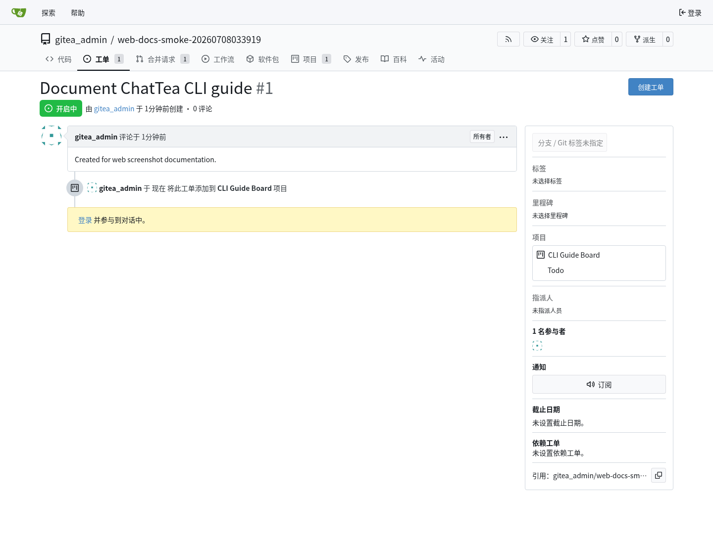
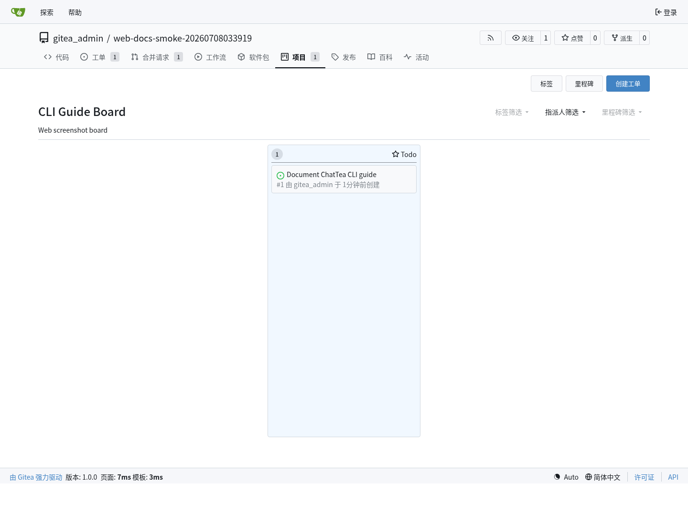
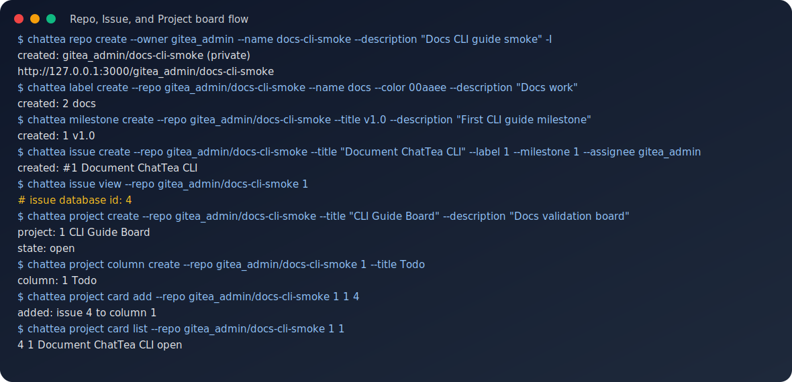
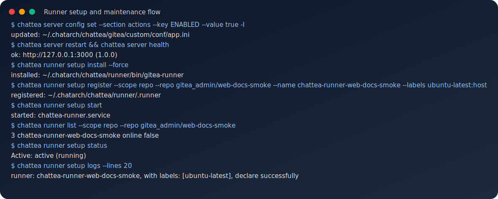

# ChatTea CLI 指南

这篇指南是当前 ChatTea Gitea 能力面的实用 CLI 地图。它覆盖已实现命令树、每个主要命令组背后的 REST API 或本地 辅助函数，以及来自本地 ChatTea 管理的 Gitea 服务的实践示例。

## 当前 CLI 树

```text
chattea
├── set-token                 # ChatTea/Git token bootstrap helper
├── server                    # 本地 ChatArch Gitea 生命周期
│   ├── config                # app.ini path/show/get/set helper
│   ├── install               # 安装 ChatArch internal Gitea binary
│   ├── init                  # 初始化托管 Gitea app.ini/work path
│   ├── bootstrap             # install + init + admin + token bootstrap
│   ├── serve                 # 前台 web 进程
│   ├── start/stop/restart    # user systemd service 生命周期
│   ├── status/logs           # user systemd 检查
│   ├── version               # 本地 Gitea binary version
│   └── health                # REST: GET /api/v1/version
├── repo                      # 仓库 REST API + git clone helper
│   ├── list/view/create
│   ├── clone                 # 本地 git helper
│   └── migrate
├── issue                     # REST: /repos/{owner}/{repo}/issues
│   ├── list/view/create/edit/close/reopen/delete
│   ├── comment list/create/edit/delete
│   ├── label add/remove
│   └── assign add/remove
├── label                     # REST: /repos/{owner}/{repo}/labels
│   └── list/view/create/edit/delete
├── milestone                 # REST: /repos/{owner}/{repo}/milestones
│   └── list/view/create/edit/close/delete
├── pr                        # REST: /repos/{owner}/{repo}/pulls
│   ├── list/view/create/edit/close/reopen/merge
│   ├── diff/patch/commits/files
│   ├── comment list/create
│   └── review list/create/submit
├── release                   # REST: /repos/{owner}/{repo}/releases
│   ├── list/view/latest/by-tag/create/edit/delete
│   └── asset list/delete
├── project                   # Gitea repo-scoped 项目看板
│   ├── list/view/create/edit/delete
│   ├── column list/create/edit/delete
│   ├── card list/add/remove/move
│   └── issue list/add/remove/move   # card 的兼容别名
├── runner                    # Gitea Actions runner API + 本地 setup
│   ├── token/list/view/edit/delete  # REST: /actions/runners
│   └── setup install/register/start/stop/status/logs/doctor
├── run                       # REST: /repos/{owner}/{repo}/actions/runs
│   └── list/view/jobs/logs/rerun/rerun-failed/delete
├── job                       # REST: /repos/{owner}/{repo}/actions/jobs
│   └── view/logs/rerun
├── artifact                  # REST: /repos/{owner}/{repo}/actions/artifacts
│   └── list/view/download/delete
├── auth                      # auth/login/status/token 便利入口
├── token                     # Gitea access token create/list/delete/bootstrap
└── api                       # 原始 Gitea API passthrough
```

## 实现合约

ChatTea 命令应是薄 Click 包装层。每个实质命令都调用一个可导入 Python 函数或 `GiteaClient` method。

示例：

```python
from chattea.api import GiteaClient
from chattea.commands.repo import create_repository
from chattea.commands.issue import create_issue
from chattea.commands.project import add_card
from chattea.commands.runner import register_runner
from chattea.commands.run import list_runs
from chattea.commands.job import job_logs

client = GiteaClient()
repo = create_repository(name="demo", owner="gitea_admin")
issue = create_issue("gitea_admin/demo", title="Document CLI")
add_card("gitea_admin/demo", project_id=1, column_id=1, issue_id=issue["id"])
register_runner(scope="repo", repo="gitea_admin/demo", name="chattea-runner-demo")
runs = list_runs("gitea_admin/demo")
logs = job_logs("gitea_admin/demo", job_id=6)
```

## 服务和令牌流程

本地开发服务从 ChatEnv 和 Gitea server lifecycle 命令开始：

```bash
chattea server bootstrap -I
chattea server health
chattea token bootstrap --username gitea_admin --password-env GITEA_ADMIN_PASSWORD --scope all
```

需要 Actions 时，先在 Gitea `app.ini` 中启用，然后重启托管服务：

```bash
chattea server config set --section actions --key ENABLED --value true -I
chattea server restart
chattea server health
```

`server config set` 修改的是 `app.ini`；这是运行时配置，通常需要 restart 才可靠生效。相比之下，问题/PR/project/run/job/运行器 的 REST API 命令操作的是 live Gitea state，不需要重启 Gitea。

Token 边界要分清楚：ChatTea 这个 Python 源码仓库的 remote 是 GitHub，push 和 PR 使用 `chatgh` / GitHub token；临时实践仓库的 remote 是自建 Gitea，仓库 API 和 git push 使用 `chattea` / Gitea token。`chattea set-token` 只应在 Gitea 仓库目录里写 repo-local git `extraHeader`，或者通过 `--repo OWNER/NAME` 明确指定 Gitea 仓库；不应把 Gitea token 写进 GitHub 源码仓库的 local git config。

## 仓库、问题和项目看板示例

下面流程在本地 ChatTea 管理的 Gitea 服务上运行：创建 仓库，添加 问题 元数据，创建 仓库级 项目看板，然后把 问题 添加为 项目卡片。

Gitea Web 问题 页面：



Gitea Web 项目看板 页面：



同一流程的 CLI 记录：



重要细节：`project card add` 映射到 Gitea 项目卡片 API，期望的是 问题 数据库 `id`，不是页面上显示的 问题编号 `#1`。可以运行 `chattea issue view --repo OWNER/REPO 1`，读取返回里的 `id` 字段。

核心 路由 映射：

```text
chattea issue create       -> POST /repos/{owner}/{repo}/issues
chattea issue view         -> GET /repos/{owner}/{repo}/issues/{index}
chattea project create     -> POST /repos/{owner}/{repo}/projects
chattea project column     -> /repos/{owner}/{repo}/projects/{project_id}/columns
chattea project card add   -> POST /repos/{owner}/{repo}/projects/{project_id}/columns/{column_id}/issues/{issue_id}
```

## 合并请求示例

PR 是一个仓库 REST API 操作。下面截图是 `chattea pr create` 创建出的 Gitea Web 合并请求 页面。


CLI 命令：

```bash
chattea pr create \
  --repo gitea_admin/demo \
  --title "Trigger Actions practice" \
  --head feature/practice \
  --base main \
  --body "Created by ChatTea practice"

chattea pr list --repo gitea_admin/demo --state all
chattea pr view --repo gitea_admin/demo 1
chattea pr diff --repo gitea_admin/demo 1
chattea pr files --repo gitea_admin/demo 1
```

路由 映射：

```text
chattea pr create      -> POST /repos/{owner}/{repo}/pulls
chattea pr list/view   -> GET /repos/{owner}/{repo}/pulls
chattea pr diff/patch  -> GET /repos/{owner}/{repo}/pulls/{index}.diff/.patch
chattea pr merge       -> POST /repos/{owner}/{repo}/pulls/{index}/merge
```

实践注意：推送新分支后立刻创建 PR，可能和 Gitea 分支可见性刷新产生竞态。如果刚 push 后 Gitea 返回 `404`，短暂等待后用同一个 `head=feature/practice` payload 重试即可。

## 运行器和 Actions 流程

运行器支持分两层：

1. Gitea REST API 层：
   - 注册令牌
   - 运行器 list/view/edit/delete
   - repo/user/org/admin scope
2. 本地 setup 层：
   - 安装 `gitea-runner`
   - 写运行器 config
   - 用 Gitea 注册令牌注册运行器
   - 管理 `chattea-runner.service` 或手动启动多个 runner daemon

第一版实现默认使用 host 运行器标签：

```text
<runner-label>:host
```

workflow 中使用冒号前的 label：

```yaml
runs-on: <runner-label>
```

真实实践已经验证：repo-scope 两个 host runner 可以在同一台机器、同一 Unix 用户下并发处理同一个 PR workflow 的两个 job；user-scope、org-scope、admin-scope runner 也分别被对应仓库 workflow 调用成功。更完整的配置、运行目录、scope 和并发结论见 [Actions / Flow（动作 / 流程）快速开始](actions-flow-quickstart.md)。

下面的 Actions run 和 job 页面展示工作流被注册运行器接收并成功完成。


运行器 setup 和维护的 CLI 记录：



路由 和 辅助函数 映射：

```text
chattea runner token       -> POST /repos/{owner}/{repo}/actions/runners/registration-token
chattea runner list        -> GET /repos/{owner}/{repo}/actions/runners
chattea runner edit        -> PATCH /repos/{owner}/{repo}/actions/runners/{runner_id}
chattea runner delete      -> DELETE /repos/{owner}/{repo}/actions/runners/{runner_id}
chattea runner setup *     -> local helper around ~/.chatarch/chattea/runner and user systemd
```

`runner edit` 使用 Gitea 的 `disabled` 字段。CLI 中暴露为 `--disabled` 和 `--enabled`。

## 运行、任务和日志示例

PR 触发 工作流 后，主要操作面是 `run` 和 `job`。运行器 章节展示了 Gitea run/job 页面；下面的 CLI 记录 展示同一状态如何通过 ChatTea 命令查看。


路由 映射：

```text
chattea run list           -> GET /repos/{owner}/{repo}/actions/runs
chattea run view           -> GET /repos/{owner}/{repo}/actions/runs/{run}
chattea run jobs           -> GET /repos/{owner}/{repo}/actions/runs/{run}/jobs
chattea run logs           -> 聚合 run jobs 和 job logs 的 helper
chattea run rerun          -> POST /repos/{owner}/{repo}/actions/runs/{run}/rerun
chattea run rerun-failed   -> POST /repos/{owner}/{repo}/actions/runs/{run}/rerun-failed-jobs
chattea job view           -> GET /repos/{owner}/{repo}/actions/jobs/{job_id}
chattea job logs           -> GET /repos/{owner}/{repo}/actions/jobs/{job_id}/logs
chattea job rerun          -> POST /repos/{owner}/{repo}/actions/runs/{run}/jobs/{job_id}/rerun
```

已验证的本地实践结果：

```text
repository: gitea_admin/<actions-practice-repo>
runner: <chattea-runner-name>
pull_request run: 9
job: 9
result: success
log marker: workflow output marker appears in job logs
```

## 产物命令

工作流 上传 产物 后，可以通过 CLI 包装的 仓库 Actions 产物 API 查看、下载和删除：

```bash
chattea artifact list --repo gitea_admin/demo
chattea artifact list --repo gitea_admin/demo --run-id 6
chattea artifact view --repo gitea_admin/demo 10
chattea artifact download --repo gitea_admin/demo 10 --output artifact.zip
chattea artifact delete --repo gitea_admin/demo 10
```

路由 映射：

```text
chattea artifact list      -> GET /repos/{owner}/{repo}/actions/artifacts
chattea artifact view      -> GET /repos/{owner}/{repo}/actions/artifacts/{artifact_id}
chattea artifact download  -> GET /repos/{owner}/{repo}/actions/artifacts/{artifact_id}/zip
chattea artifact delete    -> DELETE /repos/{owner}/{repo}/actions/artifacts/{artifact_id}
```

## 当前刻意不做一等封装的部分

下面这些仍可通过 `chattea api` 访问，但不属于第一版 打磨后的 CLI 能力面：

```text
chattea workflow list/view/dispatch/enable/disable
chattea secret list/set/delete
chattea variable list/view/create/edit/delete
```

工作流 定义文件仍放在 git 中，例如 `.gitea/workflows/*.yml`。第一版端到端流程里，推送 工作流 文件，再配合 运行器/run/job/log 命令，是最直接的验证信号。
