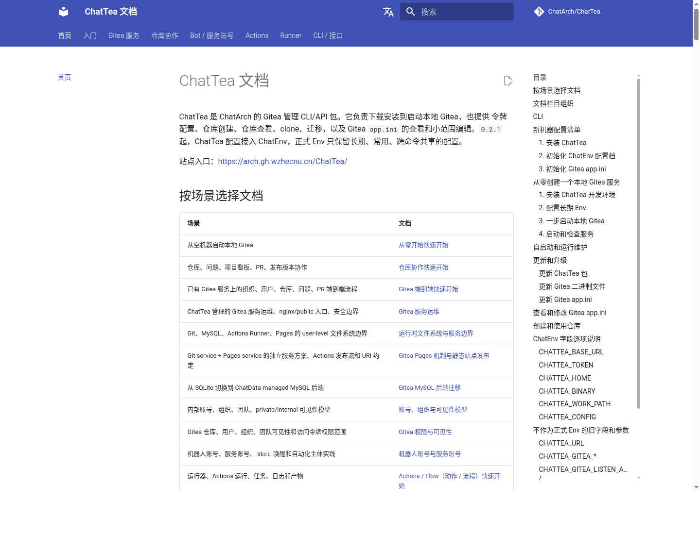

# Gitea Pages 机制与静态站点发布

这篇文档定义 ChatTea Pages v0.1 的默认实现认识：Gitea 主站继续作为 Git 代码服务，Pages 作为独立静态站点服务，Actions 负责把仓库内容构建并发布到 Pages。文档使用占位符，不写真实域名、机器路径、账号、令牌或证书路径。

## 当前需求

我们要把 Pages 当成和 Git 并列的第二个 Web 服务，而不是把用户站点塞进 Gitea 主站进程或主站同源路径里。

核心需求：

1. ChatTea 托管两个对外 Web 服务：Git service 和 Pages service。
2. Gitea Actions / Runner 由 ChatTea 管理，但它是执行面 worker，不是第三个对外网站。
3. Actions 要能直接发布 Pages：构建完成后调用发布命令，Pages service 已经在 serve，发布完即可访问。
4. Pages URL 使用 path 模式：`https://<pages-domain>/<owner>/<repo>/`，不默认分配三级域名。
5. 域名、TLS、redirect、主站入口、custom domain 和 resolver 属于 Nginx/Caddy 或后续 resolver 层，不绑进 v0.1 核心。
6. 第一版不 fork Gitea，不做私有 Pages 鉴权，不做自定义域名，不把 Pages 正文放在 Gitea 主站同源下。

## 一句话模型

```text
Git service:
  Gitea 主站、Git 仓库、API、Actions 调度、runner registry。

Actions worker:
  runner daemon 执行 workflow job，构建静态目录，调用 Pages publish。

Pages service:
  直接 serve 已发布静态文件。
```

从对外服务看，第一版只有两个 Web 服务：

```text
https://<gitea-domain>/              # Git service
https://<pages-domain>/<owner>/<repo>/ # Pages service，owner/repo 放在 URI path 中
```

Nginx/Caddy 可以把这两个服务统一挂到同一台机器、同一套证书或同一个公网入口下，但那是入口整合问题，不改变 ChatTea 的服务边界。

## 服务和文件边界

ChatTea 的 user-level 目标是让服务状态落在普通 Unix 用户可控的文件树里。详细文件系统说明见 [ChatTea 运行时文件系统与服务边界](runtime-filesystem-layout.md)。这里给出 Pages 相关的最小关系：

```text
<chattea-home>/gitea/                      # Git service 状态
<chattea-home>/runners/<runner-name>/      # Actions worker 状态
<chattea-home>/pages/                      # Pages service 状态
<chattea-home>/pages/sites/<owner>/<repo>/ # 已发布站点
```

对应 user-level unit 形态：

```text
chattea-gitea.service                  # Git service
chattea-runner@<runner-name>.service   # Actions worker，不是 Web service
chattea-pages.service                  # Pages service
```

## URL 约定

Pages v0.1 使用 path-based URL，不默认分配三级域名：

```text
Gitea 仓库：  https://<gitea-domain>/<owner>/<repo>
Pages 正文：  https://<pages-domain>/<owner>/<repo>/
仓库链接：    repo.website = https://<pages-domain>/<owner>/<repo>/
```

可选主站入口可以后续由 Nginx/Caddy 或 Gitea UI 提供：

```text
https://<gitea-domain>/pages/<owner>/<repo>/  -> 302 到 https://<pages-domain>/<owner>/<repo>/
```

这个入口只做跳转或状态展示，不直接返回用户提交的 HTML。原因是浏览器同源只看 scheme、host 和 port，不看 path；如果把任意用户 Pages 正文放到 Gitea 主站同源路径下，用户 JS 会处在 Gitea 主站 origin 里，安全边界会变复杂。

## Actions 到 Pages 的发布流

v0.1 的主路径是 Actions 直接发布到 Pages root：

```text
1. 用户 push main
2. Gitea 读取 .gitea/workflows/*.yml，创建 workflow run / job
3. runner daemon 按 scope + runs-on label 领取 job
4. workflow 在 runner workdir 中 checkout 代码
5. workflow 构建 site/ 或 public/
6. workflow 调用 chattea pages publish --repo <owner>/<repo> --source site
7. publish 写入 Pages staging 目录
8. publish 原子替换 Pages sites/<owner>/<repo>/
9. Pages service 正在 serve，URL 立即可访问
```

这里不要求用户手动维护 `pages` 分支。`pages` 分支可以作为后续可选镜像或审计历史，但不是 v0.1 的主发布路径。

## 完整打通流程

### 1. 在仓库里添加 workflow YAML

仓库只要在默认分支提交 `.gitea/workflows/pages.yml`，Gitea push 后就会把它识别为 Actions workflow。下面是当前验证链路使用的结构：

```yaml
name: ChatTea Pages

on:
  push:
    branches:
      - main

jobs:
  pages:
    runs-on: ubuntu-latest
    steps:
      - name: Show action context
        run: |
          echo "repo=$GITHUB_REPOSITORY"
          echo "sha=$GITHUB_SHA"
          echo "run=$GITHUB_RUN_ID"
          pwd

      - name: Clone repository
        run: |
          rm -rf source site
          git clone "<gitea-loopback-url>/$GITHUB_REPOSITORY.git" source
          cd source
          git checkout "$GITHUB_SHA"

      - name: Build MkDocs site
        run: |
          mkdocs build \
            --clean \
            -f source/mkdocs.yml \
            --site-dir "$PWD/site"

      - name: Publish Pages
        run: |
          chattea pages publish \
            --repo "$GITHUB_REPOSITORY" \
            --source "$PWD/site" \
            --commit "$GITHUB_SHA" \
            --run-id "$GITHUB_RUN_ID"
```

关键点：

- `on.push.branches` 决定什么分支触发 Pages 构建；
- `runs-on: ubuntu-latest` 必须能匹配一个在线 runner 的 label；
- `GITHUB_REPOSITORY` 是 Gitea runner 注入的 `owner/repo`；
- `GITHUB_SHA` 是触发本次 run 的 commit；
- `GITHUB_RUN_ID` 用于写入 Pages 发布元数据；
- 正式 CLI 落地前，验证环境可以把 `chattea pages publish` 替换成受管 Pages publisher 脚本；接口参数保持一致。

如果 runner 环境可以稳定使用 checkout action，也可以把 `Clone repository` 换成 `uses: actions/checkout@v4`。内网或离线环境建议显式从本机 Gitea loopback clone，避免依赖外部 marketplace。

### 2. Gitea 如何找到并执行这个 Action

当 `pages.yml` 被 push 到默认分支后：

```text
Git push
  -> Gitea 收到 refs/heads/main 更新
  -> Gitea 读取 .gitea/workflows/pages.yml
  -> 创建 workflow run 和 job
  -> 查找 scope 覆盖该仓库、label 匹配 runs-on 的 runner
  -> runner 领取 pages job 并执行 steps
```

可以用 Web UI 看：

```text
<gitea-domain>/<owner>/<repo>/actions
<gitea-domain>/<owner>/<repo>/actions/runs/<run-id>
```

也可以用 CLI 查：

```bash
chattea runner registry list --scope repo --repo <owner>/<repo> --json-output
chattea run list --repo <owner>/<repo> --json-output
chattea run jobs --repo <owner>/<repo> <run-id> --json-output
chattea job logs --repo <owner>/<repo> <job-id>
```

当前验证中的 Actions run 页面如下：


### 3. Pages 部署到哪里

`chattea pages publish` 不负责构建，只负责把已构建好的静态目录发布到 Pages service 的 root 下：

```text
source site/
  -> <chattea-home>/pages/staging/<tmp>/
  -> atomic replace
  -> <chattea-home>/pages/sites/<owner>/<repo>/
```

发布后的目录形态：

```text
<chattea-home>/pages/sites/<owner>/<repo>/
├── index.html
├── assets/
├── en/
└── .chattea-pages.json
```

`.chattea-pages.json` 记录最后一次发布来源：

```json
{
  "repo": "<owner>/<repo>",
  "commit": "<commit-sha>",
  "run_id": "<actions-run-id>",
  "published_at": "<timestamp>",
  "source": "gitea-actions"
}
```

Pages service 长驻运行，只 serve `<chattea-home>/pages/sites`。因此 publish 完不需要重启服务，站点路径会立即生效。

### 4. 怎么访问发布后的站点

默认访问路径：

```text
https://<pages-domain>/<owner>/<repo>/
```

仓库 metadata 的 website 字段也应指向同一个地址：

```bash
chattea repo edit <owner>/<repo> \
  --website https://<pages-domain>/<owner>/<repo>/
```

验证命令：

```bash
curl -I https://<pages-domain>/<owner>/<repo>/
curl https://<pages-domain>/<owner>/<repo>/ | grep -i '<title>'
```

当前验证中的 Pages 页面如下：



## Pages service 目录

建议默认目录：

```text
<chattea-home>/pages/
├── config.yaml
├── sites/
│   └── <owner>/
│       └── <repo>/
│           ├── index.html
│           ├── assets/
│           └── .chattea-pages.json
├── staging/
└── log/
```

发布元数据示例：

```json
{
  "repo": "<owner>/<repo>",
  "commit": "<commit-sha>",
  "run_id": "<actions-run-id>",
  "published_at": "<timestamp>",
  "source": "gitea-actions"
}
```

`publish` 命令只做文件操作：检查 source、写元数据、复制到 staging、设置权限、原子替换目标站点目录。构建本身在 Actions job 中完成。

## Workflow 模板

MkDocs 项目示例：

```yaml
name: Pages

on:
  push:
    branches:
      - main

jobs:
  pages:
    runs-on: ubuntu-latest
    steps:
      - uses: actions/checkout@v4

      - name: Build site
        run: |
          python -m pip install -e '.[docs]'
          mkdocs build --site-dir site

      - name: Publish Pages
        run: |
          chattea pages publish \
            --repo "$GITHUB_REPOSITORY" \
            --source site \
            --commit "$GITHUB_SHA" \
            --run-id "$GITHUB_RUN_ID"
```

前端项目示例：

```yaml
      - name: Build site
        run: |
          npm ci
          npm run build

      - name: Publish Pages
        run: |
          chattea pages publish \
            --repo "$GITHUB_REPOSITORY" \
            --source dist \
            --commit "$GITHUB_SHA" \
            --run-id "$GITHUB_RUN_ID"
```

Runner 必须能访问 `chattea` 命令和 `<chattea-home>/pages/`。host 后端下，job 以 runner service 的 Unix 用户执行，因此第一版适合可信内网 workflow。更强隔离需要后续设计独立用户、容器、虚拟机或一次性 runner。

## Pages service 部署模式

第一版建议让 Pages service 自己监听 loopback，Nginx/Caddy 只做代理：

```text
chattea-pages.service
  listen: 127.0.0.1:<pages-port>
  root:   <chattea-home>/pages/sites
```

Nginx/Caddy 入口示例：

```nginx
server {
    listen 443 ssl;
    server_name <pages-domain>;

    location / {
        proxy_pass http://127.0.0.1:<pages-port>;
        proxy_set_header Host $host;
        proxy_set_header X-Forwarded-Proto https;
    }
}
```

这保持了三层职责：

- ChatTea 负责 Git service、runner worker、Pages service 和文件状态；
- Pages service 负责 path 到 `sites/<owner>/<repo>/` 的静态 serve；
- Nginx/Caddy 负责 TLS、域名、redirect 和公网/内网入口整合。

## CLI 目标

Pages v0.1 需要新增的是本地 backend 命令，不是 Gitea REST API 命令：

```text
chattea pages service bootstrap  # 初始化 <chattea-home>/pages、写 config、安装 user service
chattea pages service start      # 启动 chattea-pages.service
chattea pages service stop       # 停止 Pages service
chattea pages service status     # 查看 service 状态和监听地址
chattea pages service logs       # 查看 Pages service 日志

chattea pages publish            # 从本地静态目录发布到 sites/<owner>/<repo>/
chattea pages status             # 检查 repo website、最后发布元数据、HTTP 访问
chattea pages workflow template  # 输出 MkDocs/npm 等 workflow 模板
```

已有命令仍然负责通用 Git service 能力：

```bash
chattea repo create ...
chattea repo edit <owner>/<repo> --website https://<pages-domain>/<owner>/<repo>/
chattea runner local register/start/status ...
chattea run list/view/jobs/logs ...
```

## 非目标

v0.1 不做这些事情：

- 不 fork Gitea 源码；
- 不把用户 Pages 正文放在 Gitea 主站同源路径；
- 不默认生成 `<repo>.<owner>.<pages-domain>` 这类三级域名；
- 不做 custom domain resolver；
- 不做私有 Pages 鉴权；
- 不把构建逻辑塞进 Pages service；
- 不把 Nginx/Caddy 入口整合视为 Pages 核心状态。

## 参考验证

```bash
chattea pages service status
chattea pages publish --repo <owner>/<repo> --source <site-build-dir>
chattea pages status --repo <owner>/<repo>
curl --noproxy '*' -sS -I https://<pages-domain>/<owner>/<repo>/
```

`chattea pages ...` 是目标命令，进入实现前可用手工文件同步和 `curl` 替代验证。