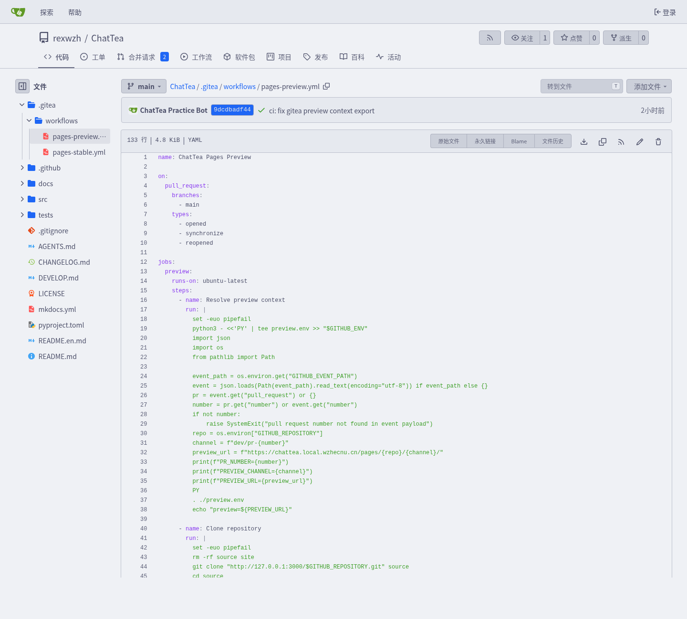
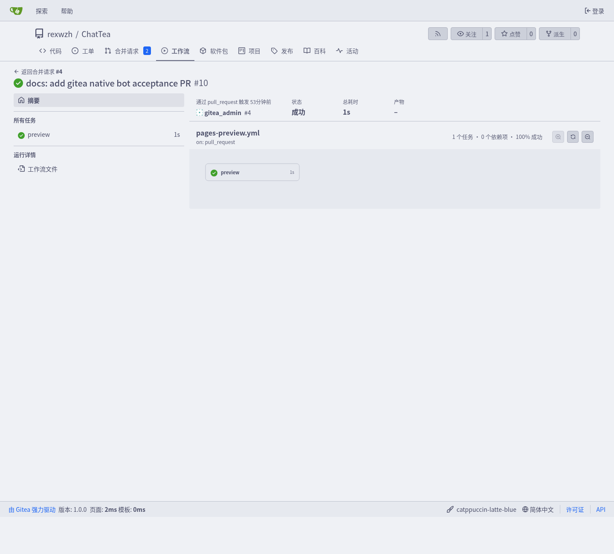
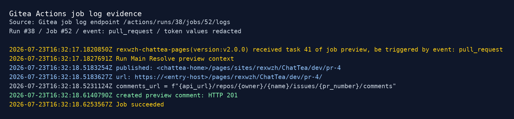
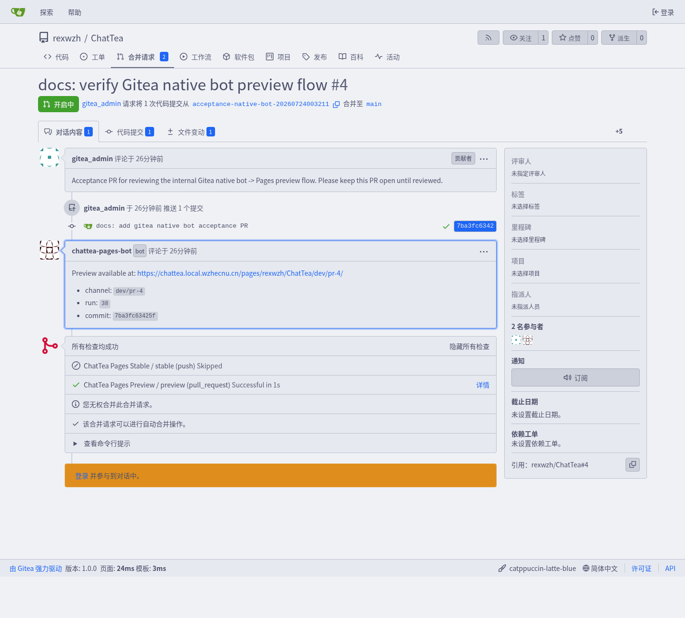
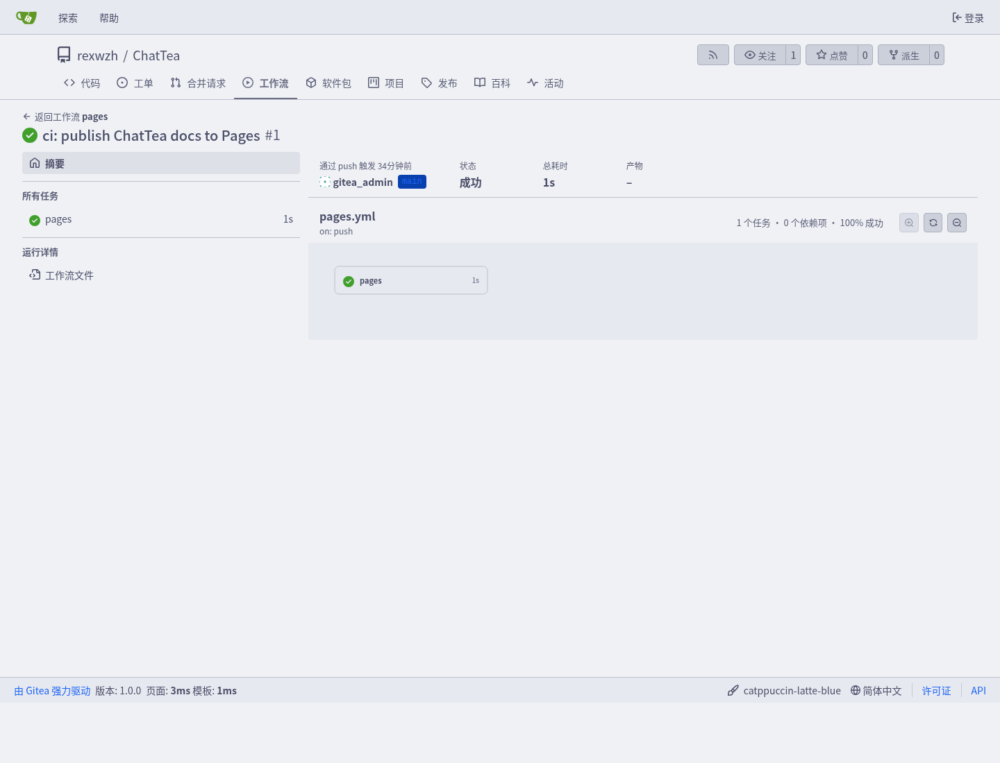

# Gitea Pages 机制与静态站点发布

这篇文档定义 ChatTea Pages v0.1 的默认实现认识：Gitea 主站继续作为 Git 代码服务，Pages 作为独立静态站点服务，Actions 负责把仓库内容构建并发布到 Pages。文档使用占位符，不写真实域名、机器路径、账号、令牌或证书路径。

## 当前需求

我们要把 Pages 当成和 Git 并列的第二个 Web 服务，而不是把用户站点塞进 Gitea 主站进程或主站同源路径里。

核心需求：

1. ChatTea 托管两个对外 Web 服务：Git service 和 Pages service。
2. Gitea Actions / Runner 由 ChatTea 管理，但它是执行面 worker，不是第三个对外网站。
3. Actions 要能直接发布 Pages：构建完成后调用发布命令，Pages service 已经在 serve，发布完即可访问。
4. Pages URL 使用 path 模式：`https://<pages-domain>/<owner>/<repo>/`，不默认分配三级域名。
5. 域名、TLS、redirect、主站入口、custom domain 和 resolver 属于 Nginx/Caddy 或后续 resolver 层，不绑进 v0.1 核心。
6. 第一版不 fork Gitea，不做私有 Pages 鉴权，不做自定义域名，不把 Pages 正文放在 Gitea 主站同源下。

## 一句话模型

```text
Git service:
  Gitea 主站、Git 仓库、API、Actions 调度、runner registry。

Actions worker:
  runner daemon 执行 workflow job，构建静态目录，调用 Pages publish。

Pages service:
  直接 serve 已发布静态文件。
```

从对外服务看，第一版只有两个 Web 服务：

```text
https://<gitea-domain>/              # Git service
https://<pages-domain>/<owner>/<repo>/ # Pages service，owner/repo 放在 URI path 中
```

Nginx/Caddy 可以把这两个服务统一挂到同一台机器、同一套证书或同一个公网入口下，但那是入口整合问题，不改变 ChatTea 的服务边界。

## 服务和文件边界

ChatTea 的 user-level 目标是让服务状态落在普通 Unix 用户可控的文件树里。详细文件系统说明见 [ChatTea 运行时文件系统与服务边界](runtime-filesystem-layout.md)。这里给出 Pages 相关的最小关系：

```text
<chattea-home>/gitea/                      # Git service 状态
<chattea-home>/runners/<runner-name>/      # Actions worker 状态
<chattea-home>/pages/                      # Pages service 状态
<chattea-home>/pages/sites/<owner>/<repo>/ # 已发布站点
```

对应 user-level unit 形态：

```text
chattea-gitea.service                  # Git service
chattea-runner@<runner-name>.service   # Actions worker，不是 Web service
chattea-pages.service                  # Pages service
```

## URL 约定

Pages v0.1 使用 path-based URL，不默认分配三级域名：

```text
Gitea 仓库：  https://<gitea-domain>/<owner>/<repo>
Pages 正文：  https://<pages-domain>/<owner>/<repo>/
仓库链接：    repo.website = https://<pages-domain>/<owner>/<repo>/
```

可选主站入口可以后续由 Nginx/Caddy 或 Gitea UI 提供：

```text
https://<gitea-domain>/pages/<owner>/<repo>/  -> 302 到 https://<pages-domain>/<owner>/<repo>/
```

这个入口只做跳转或状态展示，不直接返回用户提交的 HTML。原因是浏览器同源只看 scheme、host 和 port，不看 path；如果把任意用户 Pages 正文放到 Gitea 主站同源路径下，用户 JS 会处在 Gitea 主站 origin 里，安全边界会变复杂。

## Actions 到 Pages 的发布流

推荐主路径是 Git-backed branch deploy，完整说明见 [Git-backed Pages 分支部署](gitea-pages-branch-deploy.md)：

```text
1. 用户 push main 或更新 PR
2. Gitea 读取 .gitea/workflows/*.yml，创建 workflow run / job
3. runner daemon 按 scope + runs-on label 领取 job
4. workflow 在 runner node 上 checkout 代码并构建 site/ 或 public/
5. workflow 把静态产物 commit/push 到配置好的 Pages 分支，例如 gh-pages
6. Pages Host syncer 从 Gitea fetch/checkout 该 Pages 分支
7. syncer 把静态目录写入 staging，并原子替换 pages/sites/<owner>/<repo>/<channel>
8. Pages service 正在 serve，URL 立即可访问
```

这个模型不要求 runner 和 Pages Host 在同一台机器上，也不要求 runner 挂载或写入 Host 的 `<chattea-home>/pages/sites`。runner 只需要访问 Gitea，并拥有写 Pages 分支的权限；Pages Host 只需要读取配置好的 Pages 分支。

Host-local publish 仍可作为内网 smoke test 或兼容模式：workflow 直接调用 `chattea pages publish --source site` 写入本机 Pages root。但这不应作为 heavy docs、Lean/mathlib docs 或生产部署的默认模型。

## Host-local publish 验证流程

这一节保留的是早期内网 smoke test 方式：runner 直接调用本机 publisher，把已构建目录写到 Pages Host 的 `pages/sites`。它适合验证 Gitea Actions、bot comment、channel metadata 等链路，但不是 heavy docs 的推荐生产路径。推荐生产路径请看 [Git-backed Pages 分支部署](gitea-pages-branch-deploy.md)。

### 1. 在仓库里添加 workflow YAML

仓库只要在默认分支提交 `.gitea/workflows/pages.yml`，Gitea push 后就会把它识别为 Actions workflow。下面是 Host-local 验证链路使用的结构：

```yaml
name: ChatTea Pages

on:
  push:
    branches:
      - main

jobs:
  pages:
    runs-on: ubuntu-latest
    steps:
      - name: Show action context
        run: |
          echo "repo=$GITHUB_REPOSITORY"
          echo "sha=$GITHUB_SHA"
          echo "run=$GITHUB_RUN_ID"
          pwd

      - name: Clone repository
        run: |
          rm -rf source site
          git clone "<gitea-loopback-url>/$GITHUB_REPOSITORY.git" source
          cd source
          git checkout "$GITHUB_SHA"

      - name: Build MkDocs site
        run: |
          mkdocs build \
            --clean \
            -f source/mkdocs.yml \
            --site-dir "$PWD/site"

      - name: Publish Pages
        run: |
          chattea pages publish \
            --repo "$GITHUB_REPOSITORY" \
            --source "$PWD/site" \
            --commit "$GITHUB_SHA" \
            --run-id "$GITHUB_RUN_ID"
```

关键点：

- `on.push.branches` 决定什么分支触发 Pages 构建；
- `runs-on: ubuntu-latest` 必须能匹配一个在线 runner 的 label；
- `GITHUB_REPOSITORY` 是 Gitea runner 注入的 `owner/repo`；
- `GITHUB_SHA` 是触发本次 run 的 commit；
- `GITHUB_RUN_ID` 用于写入 Pages 发布元数据；
- Gitea Actions 为兼容 GitHub Actions 生态，沿用 `GITHUB_*` 环境变量名；这里的值仍然来自当前 Gitea 实例，不表示任务跑在 GitHub 上；
- 正式 CLI 落地前，验证环境可以把 `chattea pages publish` 替换成受管 Pages publisher 脚本；接口参数保持一致。

如果 runner 环境可以稳定使用 checkout action，也可以把 `Clone repository` 换成 `uses: actions/checkout@v4`。内网或离线环境建议显式从本机 Gitea loopback clone，避免依赖外部 marketplace。

### 2. PR preview 与合并后的正式 Pages

要模拟 GitHub 的 Preview Docs 行为，建议把 workflow 拆成两个 channel：

```text
pull_request -> build -> publish --channel dev/pr-<number> -> bot comment preview URL
push main    -> build -> publish --channel stable           -> update formal URL
```

对应 URL：

```text
Preview: https://<entry-host>/pages/<owner>/<repo>/dev/pr-<number>/
Stable:  https://<entry-host>/pages/<owner>/<repo>/
```

Preview workflow 的关键步骤是：

1. 从 `GITHUB_EVENT_PATH` 读取 PR number；
2. 构建站点到 `site/`；
3. 调用 `chattea pages publish --channel dev/pr-<number>`；
4. 用 Gitea 原生 bot 用户的 token 调用 Gitea issue comment API，把 preview URL 写回 PR；
5. 如果已有 `<!-- chattea-pages-preview -->` 标记的评论，就更新同一条评论，而不是重复刷屏。

Gitea 自托管实例可以直接创建原生 bot 用户，不需要先实现一个常驻 bot 服务。推荐做法是由管理员创建一个专用账号，例如 `chattea-pages-bot`：

```bash
gitea admin user create \
  --username chattea-pages-bot \
  --email chattea-pages-bot@example.invalid \
  --user-type bot \
  --fullname "ChatTea Pages Bot"

gitea admin user generate-access-token \
  --username chattea-pages-bot \
  --token-name chattea-pages-preview \
  --scopes write:issue,read:repository \
  --raw
```

把生成的 token 写入 Gitea Actions secret，例如 `CHATTEA_BOT_TOKEN`。workflow 评论步骤使用这个 secret 调 API，最终 PR 评论作者会显示为 Gitea 的 `chattea-pages-bot`，这对应 GitHub 里的 `github-actions[bot]` / bot identity 体验。

构建步骤不要暴露这个 token；评论步骤使用内联脚本调用 API，不执行仓库代码。这样可以降低 PR 代码窃取评论 token 的风险。

Stable workflow 在 main 更新时调用 `chattea pages publish --channel stable`。实现上应保证 stable 发布不会删除 `dev/pr-*` preview 目录，否则 PR preview 链接会在 main 部署后失效。

### 3. 内网验收截图

下面的截图来自一个保持 open 的内网验收 PR，用来确认 Gitea 可以完成 GitHub-like preview flow：

```text
PR opened
  -> pull_request workflow
  -> runner build
  -> publish dev/pr-N
  -> Gitea native bot comment
```

Workflow 文件本身说明这不是人工触发，而是 Gitea `pull_request` 事件触发 preview job：



Actions run 页面显示本次任务由 `pull_request` 触发，runner 完成 preview job：



Job 日志展示关键产物和 comment 创建结果：先发布 preview channel，再通过 Gitea API 创建 PR 评论：



PR timeline 中的 preview 评论由 Gitea 原生 bot 用户发出，评论里包含 `dev/pr-N` 链接：



### 4. Gitea 如何找到并执行这个 Action

当 `pages.yml` 被 push 到默认分支后：

```text
Git push
  -> Gitea 收到 refs/heads/main 更新
  -> Gitea 读取 .gitea/workflows/pages.yml
  -> 创建 workflow run 和 job
  -> 查找 scope 覆盖该仓库、label 匹配 runs-on 的 runner
  -> runner 领取 pages job 并执行 steps
```

可以用 Web UI 看：

```text
<gitea-domain>/<owner>/<repo>/actions
<gitea-domain>/<owner>/<repo>/actions/runs/<run-id>
```

也可以用 CLI 查：

```bash
chattea runner registry list --scope repo --repo <owner>/<repo> --json-output
chattea run list --repo <owner>/<repo> --json-output
chattea run jobs --repo <owner>/<repo> <run-id> --json-output
chattea job logs --repo <owner>/<repo> <job-id>
```

当前验证中的 Actions run 页面如下：



### 5. Pages 部署到哪里

`chattea pages publish` 不负责构建，只负责把已构建好的静态目录发布到 Pages service 的 root 下：

```text
source site/
  -> <chattea-home>/pages/staging/<tmp>/
  -> atomic replace
  -> <chattea-home>/pages/sites/<owner>/<repo>/
```

发布后的目录形态：

```text
<chattea-home>/pages/sites/<owner>/<repo>/
├── index.html
├── assets/
├── en/
├── .chattea-pages.json
└── dev/
    └── pr-<number>/
        ├── index.html
        └── .chattea-pages.json
```

`.chattea-pages.json` 记录最后一次发布来源：

```json
{
  "repo": "<owner>/<repo>",
  "commit": "<commit-sha>",
  "run_id": "<actions-run-id>",
  "channel": "stable",
  "published_at": "<timestamp>",
  "source": "gitea-actions"
}
```

Pages service 长驻运行，只 serve `<chattea-home>/pages/sites`。因此 publish 完不需要重启服务，站点路径会立即生效。

### 6. 怎么访问发布后的站点

默认访问路径：

```text
https://<pages-domain>/<owner>/<repo>/
```

仓库 metadata 的 website 字段也应指向同一个地址：

```bash
chattea repo edit <owner>/<repo> \
  --website https://<pages-domain>/<owner>/<repo>/
```

验证命令：

```bash
curl -I https://<pages-domain>/<owner>/<repo>/
curl https://<pages-domain>/<owner>/<repo>/ | grep -i '<title>'
```

Pages 是否可访问用 HTTP 状态、HTML title 或 metadata 校验即可，不需要在教程里放最终站点截图。

## Pages service 目录

建议默认目录：

```text
<chattea-home>/pages/
├── config.yaml
├── sites/
│   └── <owner>/
│       └── <repo>/
│           ├── index.html
│           ├── assets/
│           └── .chattea-pages.json
├── staging/
└── log/
```

发布元数据示例：

```json
{
  "repo": "<owner>/<repo>",
  "commit": "<commit-sha>",
  "run_id": "<actions-run-id>",
  "channel": "stable",
  "published_at": "<timestamp>",
  "source": "gitea-actions"
}
```

`publish` 命令只做文件操作：检查 source、写元数据、复制到 staging、设置权限、原子替换目标站点目录。构建本身在 Actions job 中完成。

## Workflow 模板

推荐的生产模板是 branch deploy：runner build 后 push 到 `gh-pages` 或配置好的 Pages 分支，Pages Host 再 sync 该分支。完整模板见 [Git-backed Pages 分支部署](gitea-pages-branch-deploy.md)。

下面保留 Host-local publish 模板作为 smoke test / 兼容模式。

MkDocs 项目示例：

```yaml
name: Pages

on:
  push:
    branches:
      - main

jobs:
  pages:
    runs-on: ubuntu-latest
    steps:
      - uses: actions/checkout@v4

      - name: Build site
        run: |
          python -m pip install -e '.[docs]'
          mkdocs build --site-dir site

      - name: Publish Pages
        run: |
          chattea pages publish \
            --repo "$GITHUB_REPOSITORY" \
            --source site \
            --commit "$GITHUB_SHA" \
            --run-id "$GITHUB_RUN_ID"
```

前端项目示例：

```yaml
      - name: Build site
        run: |
          npm ci
          npm run build

      - name: Publish Pages
        run: |
          chattea pages publish \
            --repo "$GITHUB_REPOSITORY" \
            --source dist \
            --commit "$GITHUB_SHA" \
            --run-id "$GITHUB_RUN_ID"
```

Branch deploy 模式下，runner 只需要能访问 Gitea 并拥有写 Pages 分支的权限；它不需要访问 `<chattea-home>/pages/`。Host-local publish 模式才要求 runner 能访问 `chattea` 命令和 Pages Host 的 `<chattea-home>/pages/`。因此 heavy docs、Lean/mathlib docs 或需要特殊工具链的构建，应使用外部 runner node + Git-backed branch deploy。

## Pages service 部署模式

第一版建议让 Pages service 自己监听 loopback，Nginx/Caddy 只做代理：

```text
chattea-pages.service
  listen: 127.0.0.1:<pages-port>
  root:   <chattea-home>/pages/sites
```

Nginx/Caddy 入口示例：

```nginx
server {
    listen 443 ssl;
    server_name <pages-domain>;

    location / {
        proxy_pass http://127.0.0.1:<pages-port>;
        proxy_set_header Host $host;
        proxy_set_header X-Forwarded-Proto https;
    }
}
```

这保持了三层职责：

- ChatTea 负责 Git service、runner worker、Pages service 和文件状态；
- Pages service 负责 path 到 `sites/<owner>/<repo>/` 的静态 serve；
- Nginx/Caddy 负责 TLS、域名、redirect 和公网/内网入口整合。

## CLI 目标

Pages v0.1 需要新增的是本地 backend 命令，不是 Gitea REST API 命令：

```text
chattea pages service bootstrap  # 初始化 <chattea-home>/pages、写 config、安装 user service
chattea pages service start      # 启动 chattea-pages.service
chattea pages service stop       # 停止 Pages service
chattea pages service status     # 查看 service 状态和监听地址
chattea pages service logs       # 查看 Pages service 日志

chattea pages config set         # 配置 repo 的 Git Pages source repo/branch/path/channel
chattea pages sync               # 从配置好的 Git branch checkout/sync 到 sites/<owner>/<repo>/
chattea pages status             # 检查 source branch、最后同步 metadata、HTTP 访问
chattea pages workflow template  # 输出 branch deploy / Host-local publish workflow 模板

chattea pages publish            # 兼容模式：从本地静态目录直接发布到 sites/<owner>/<repo>/
```

已有命令仍然负责通用 Git service 能力：

```bash
chattea repo create ...
chattea repo edit <owner>/<repo> --website https://<pages-domain>/<owner>/<repo>/
chattea runner local register/start/status ...
chattea run list/view/jobs/logs ...
```

## 非目标

v0.1 不做这些事情：

- 不 fork Gitea 源码；
- 不把用户 Pages 正文放在 Gitea 主站同源路径；
- 不默认生成 `<repo>.<owner>.<pages-domain>` 这类三级域名；
- 不做 custom domain resolver；
- 不做私有 Pages 鉴权；
- 不把构建逻辑塞进 Pages service；
- 不把 Nginx/Caddy 入口整合视为 Pages 核心状态。

## 参考验证

```bash
chattea pages service status
chattea pages publish --repo <owner>/<repo> --source <site-build-dir>
chattea pages status --repo <owner>/<repo>
curl --noproxy '*' -sS -I https://<pages-domain>/<owner>/<repo>/
```

`chattea pages ...` 是目标命令，进入实现前可用手工文件同步和 `curl` 替代验证。