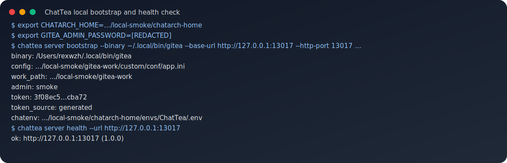
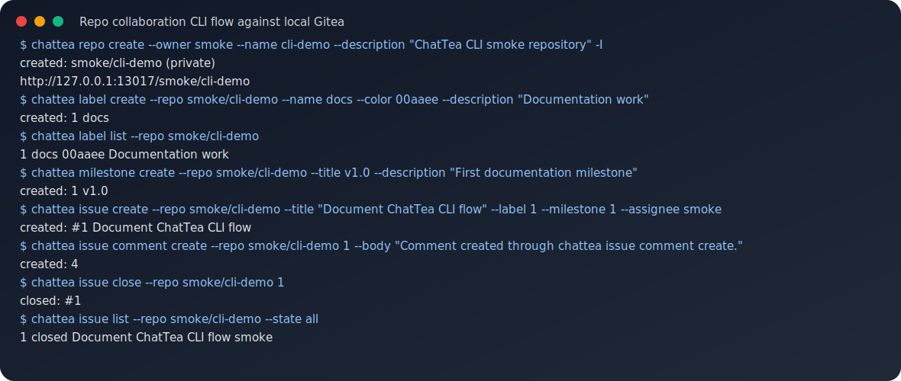
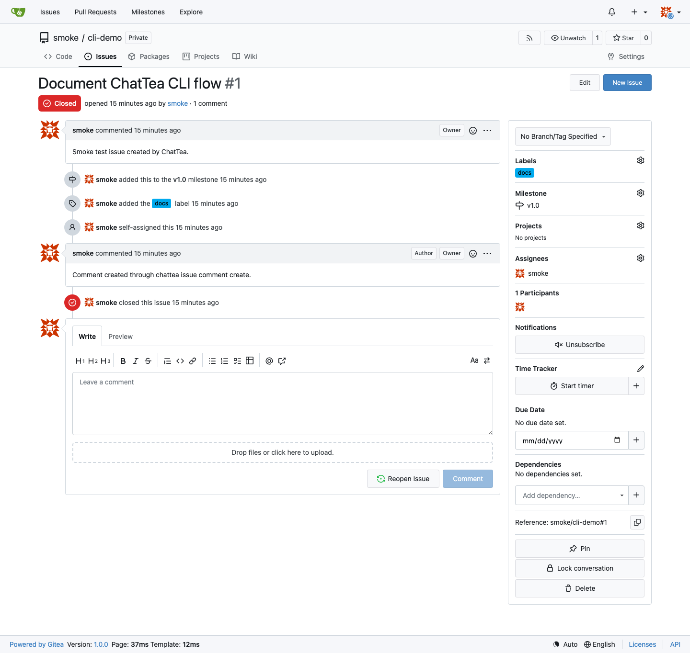
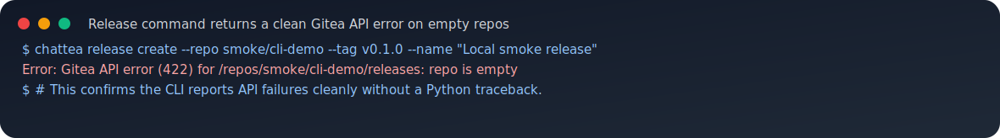

# Repo Collaboration Quick Start

This guide records one local end-to-end ChatTea CLI flow against an isolated ChatArch Gitea instance. It is intentionally a representative smoke path, not an exhaustive test of every repo-level command.

The flow covers these commands:

```text
chattea server bootstrap
chattea server health
chattea repo create
chattea label create/list
chattea milestone create/list
chattea issue create/comment/close/list
chattea release create error handling on an empty repository
```

ChatTea `0.2.3` also includes `pr`, `release`, `runner`, `run`, `job`, and `artifact` command groups. This page stays focused on repository collaboration; see [Actions / Flow Quick Start](actions-flow-quickstart.md) for runner registration, PR-triggered workflow runs, jobs, logs, and artifacts.

## 1. Bootstrap An Isolated Local Gitea

The smoke run used a task-local `CHATARCH_HOME`, task-local Gitea work path, and a local ChatArch Gitea binary. The admin password is supplied via environment variable and is never printed.



Equivalent command shape:

```bash
export CHATARCH_HOME=/path/to/local-smoke/chatarch-home
export GITEA_ADMIN_PASSWORD='[REDACTED]'

chattea server bootstrap \
  --binary ~/.local/bin/gitea \
  --work-path /path/to/local-smoke/gitea-work \
  --config /path/to/local-smoke/gitea-work/custom/conf/app.ini \
  --base-url http://127.0.0.1:13017 \
  --listen-addr 127.0.0.1 \
  --http-port 13017 \
  --admin-user smoke \
  --admin-email smoke@example.invalid \
  --admin-password-env GITEA_ADMIN_PASSWORD \
  --token-name default \
  --token-scopes all \
  -I

chattea server health --url http://127.0.0.1:13017
```

What this proves:

- ChatTea can initialize a local ChatArch Gitea instance from isolated state.
- `server bootstrap` creates the admin and token through local Gitea admin CLI.
- The generated token is masked in CLI output.
- `server health` confirms the Gitea API endpoint is reachable.

## 2. Run A Repo Collaboration Flow

After bootstrap, the same ChatEnv profile supplies `CHATTEA_BASE_URL` and `CHATTEA_TOKEN`, so the repo-level commands can run without passing token flags.



Equivalent command shape:

```bash
chattea repo create \
  --owner smoke \
  --name cli-demo \
  --description 'ChatTea CLI smoke repository' \
  -I

chattea label create \
  --repo smoke/cli-demo \
  --name docs \
  --color 00aaee \
  --description 'Documentation work'

chattea label list --repo smoke/cli-demo

chattea milestone create \
  --repo smoke/cli-demo \
  --title v1.0 \
  --description 'First documentation milestone'

chattea milestone list --repo smoke/cli-demo

chattea issue create \
  --repo smoke/cli-demo \
  --title 'Document ChatTea CLI flow' \
  --body 'Smoke test issue created by ChatTea.' \
  --label 1 \
  --milestone 1 \
  --assignee smoke

chattea issue comment create \
  --repo smoke/cli-demo \
  1 \
  --body 'Comment created through chattea issue comment create.'

chattea issue close --repo smoke/cli-demo 1
chattea issue list --repo smoke/cli-demo --state all
```

What this proves:

- `repo create` can create a repository through Gitea API.
- `label create/list` can create and read repository labels.
- `milestone create/list` can create and read repository milestones.
- `issue create` can bind label, milestone, and assignee IDs/usernames.
- `issue comment create` can add an issue comment.
- `issue close` updates issue state through the issue edit route.
- `issue list --state all` shows the final closed issue state.

The same result is visible in the Gitea web UI. The issue page shows the closed issue created by ChatTea, with the `docs` label, `v1.0` milestone, and the comment created through `chattea issue comment create`.



## 3. Release Command Error Handling

The release route is backed by `POST /api/v1/repos/{owner}/{repo}/releases`, but a release cannot be created on an empty repository. The smoke run intentionally tried this against the empty `cli-demo` repository to verify the CLI reports a clean Gitea API error instead of a Python traceback.



A release create smoke should be run against a repository with at least one commit/tag:

```bash
chattea release create \
  --repo smoke/cli-demo \
  --tag v0.1.0 \
  --name 'Local smoke release'
```

## Reviewed But Not In The Screenshot Flow

ChatTea also includes these API-backed surfaces, with unit/CLI coverage and route evidence in `docs/interface-tree.md`, `docs/cli-alignment.md`, and `docs/actions-flow-quickstart.md`:

- `chattea pr list/view/create/edit/close/reopen/merge/diff/patch/commits/files`
- `chattea pr comment list/create`
- `chattea pr review list/create/submit`
- `chattea release list/view/latest/by-tag/create/edit/delete`
- `chattea release asset list/delete`
- `chattea runner token/list/view/edit/delete`
- `chattea runner setup install/register/start/stop/status/logs/doctor`
- `chattea run list/view/jobs/logs/rerun/rerun-failed/delete`
- `chattea job view/logs/rerun`
- `chattea artifact list/view/download/delete`

Still intentionally out of this surface:

- `chattea pr checkout`: local git workflow, not part of the current REST-backed surface.
- Release asset upload: deferred until the HTTP client grows multipart upload support.
