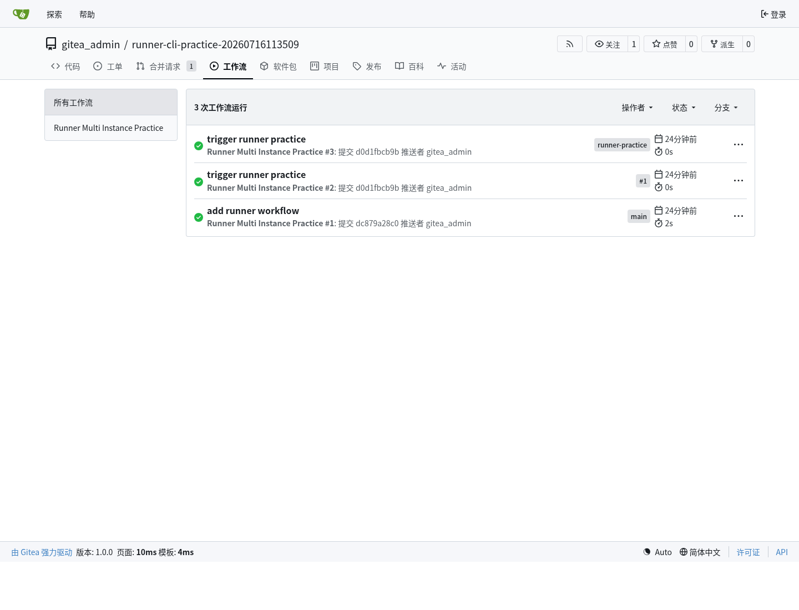
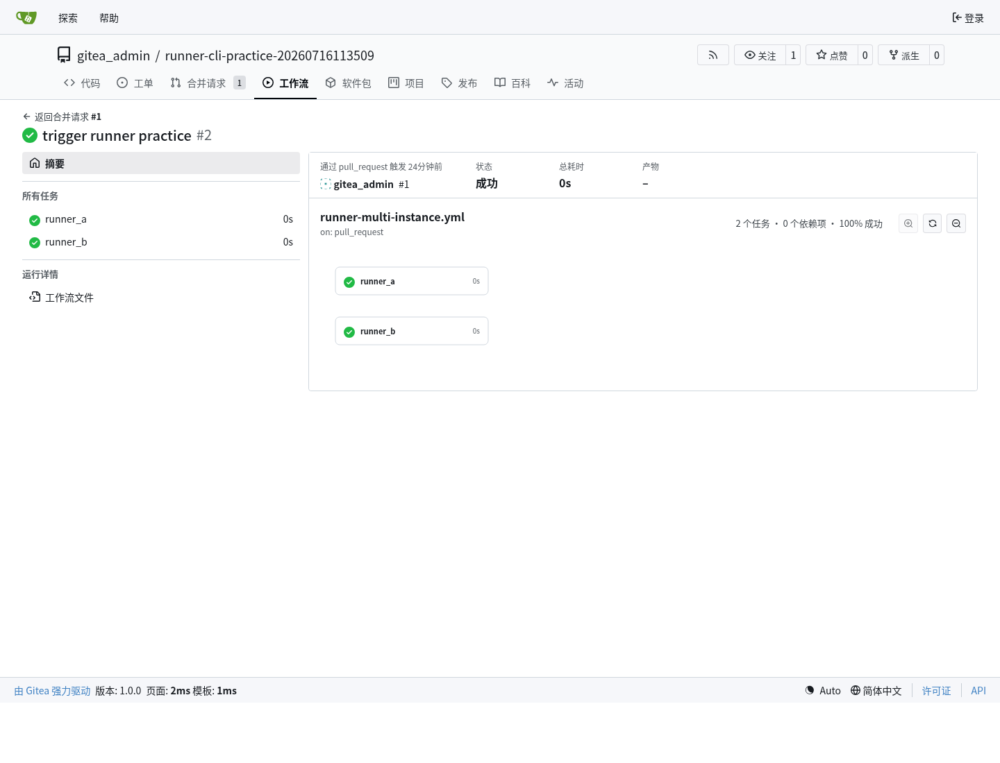
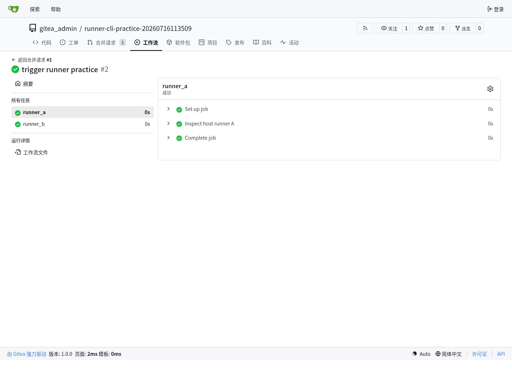
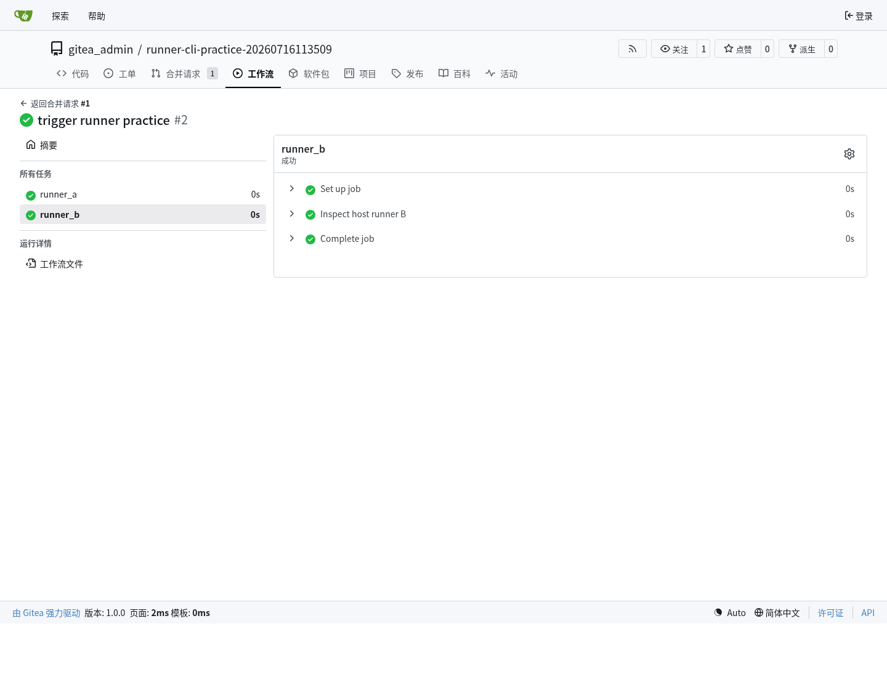
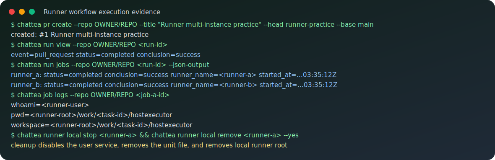

# Runner 运行环境、注册和多实例维护

这篇文档专门整理 Gitea Actions Runner 的运行环境、操作空间、状态维护、注册流程和并发方式。它基于 ChatTea Runner 独立 PR 中的真实机器实践：用新 `chattea runner local` CLI 注册两个 repo-scope host runner，通过 PR workflow 同时触发两个 job，并用 `run/job/logs` 命令确认执行结果。

公开文档只保留脱敏命令和结论：真实服务 URL、机器本地路径、token、`.runner` 内容不会写入这里。完整实践日志保存在本地 project 记录中。

## 两层状态：Gitea registry 和本机 local

Runner 有两层状态，需要分开理解。

```text
Gitea registry
├── runner id
├── runner name
├── scope: repo / user / org / admin
├── labels
├── status: online / offline
├── busy
└── disabled

Local machine
├── runner root
├── bin/gitea-runner
├── config/config.yaml
├── .runner
├── work/
└── user-level systemd service
```

因此 CLI 也拆成两类：

```text
chattea runner registry ...   # 管 Gitea 服务器上的 runner 记录
chattea runner local ...      # 管当前机器上的 runner 文件、配置和服务
```

多 runner 和 workflow 辅助则分别放在 `runner pool ...` 和 `runner workflow ...`。

## 本机安装环境

第一版多实例约定每个 runner 有独立 root：

```text
<chattea-home>/runners/<runner-name>/
├── bin/gitea-runner              # runner binary，可从已有 binary 复制
├── config/config.yaml            # runner 配置
├── .runner                       # 注册身份文件，敏感，不提交
└── work/                         # host 后端 job 工作区父目录
```

对应的用户级 systemd service：

```text
chattea-runner@<runner-name>.service
```

真实实践中用两个 runner：

```bash
chattea runner local register <runner-a> \
  --scope repo \
  --repo OWNER/REPO \
  --label <runner-a> \
  --backend host \
  --capacity 1 \
  --binary <runner-binary> \
  --json-output

chattea runner local register <runner-b> \
  --scope repo \
  --repo OWNER/REPO \
  --label <runner-b> \
  --backend host \
  --capacity 1 \
  --binary <runner-binary> \
  --json-output

chattea runner local start <runner-a>
chattea runner local start <runner-b>
```


## Host 后端和免 Docker

本轮实践使用 host 后端，不依赖 Docker。CLI 中传入的 label 是 workflow 使用的名字：

```bash
chattea runner local register <runner-name> --label lean-native --backend host
```

ChatTea 写入 runner config 时会补上后端后缀：

```yaml
runner:
  file: .runner
  capacity: 1
  labels:
    - "lean-native:host"
cache:
  enabled: false
host:
  workdir_parent: <runner-root>/work
```

workflow 中只写冒号前的 label：

```yaml
jobs:
  prove:
    runs-on: lean-native
    steps:
      - run: echo ok
```

`gitea-runner register` 会提示命令行传入的 labels 会被 config 里的 labels 覆盖，所以 ChatTea 的做法是：先写 `config.yaml`，再注册 runner；注册和后续执行都以配置文件为准。

## Job 的执行范围

host 后端下，job 由启动 runner daemon 的同一 Unix 用户执行。真实 job log 确认了这些点：

```text
whoami=<runner-user>
pwd=<runner-root>/work/<task-id>/hostexecutor
workspace=<runner-root>/work/<task-id>/hostexecutor
shell=bash --noprofile --norc -e -o pipefail {0}
```

这意味着：

- job 工作目录在该 runner root 的 `work/` 下面；
- 每个任务会进入单独的 `<task-id>/hostexecutor` 工作区；
- workflow 生成的文件先落在这个工作区里；
- job 拥有启动 runner 的 Unix 用户权限；
- host 后端不是强安全沙箱，不能把不可信 workflow 当成隔离环境执行。

如果要跑不可信任务，需要后续单独设计隔离策略，例如独立低权限用户、容器、虚拟机或一次性工作目录清理策略。

## Scope 和注册流程

Runner scope 决定 Gitea 侧哪些仓库可以使用该 runner：

| Scope | 注册命令形态 | 适用范围 |
| --- | --- | --- |
| repo | `--scope repo --repo OWNER/REPO` | 只服务指定仓库 |
| user | `--scope user` | 服务当前用户可覆盖的仓库 |
| org | `--scope org --org ORG` | 服务指定组织仓库 |
| admin | `--scope admin` | 管理员级全局 runner |

workflow 能否选中 runner，取决于两个条件：

```text
1. runner scope 覆盖该仓库；
2. workflow 的 runs-on 匹配 runner label。
```

Gitea 服务器侧可以用 registry 命令查看：

```bash
chattea runner registry list --scope repo --repo OWNER/REPO --json-output
chattea runner registry view --scope repo --repo OWNER/REPO <runner-id>
chattea runner registry disable --scope repo --repo OWNER/REPO <runner-id>
chattea runner registry enable --scope repo --repo OWNER/REPO <runner-id>
chattea runner registry delete --scope repo --repo OWNER/REPO <runner-id>
```

辅助命令可以列出当前 workflow 可写入 `runs-on` 的 labels：

```bash
chattea runner workflow labels --scope repo --repo OWNER/REPO
```

## 并发模型

并发有两个层次：

```text
单 runner daemon:
  runner.capacity 控制一个 daemon 可同时接几个 job。

多 runner instances:
  多个 runner root + 多个 systemd service + 多个 labels。
```

本轮实践采用第二种方式：

```text
runner count: 2
backend: host
capacity: 1 per runner daemon
workflow event: pull_request
workflow jobs: runner_a, runner_b
runs-on: <runner-a>, <runner-b>
result: both jobs completed successfully
started_at: both jobs started in the same second
```

也就是说，同一机器、同一 Unix 用户下，两个独立 runner service 可以并发接两个不同 job。每个 job 进入各自 runner root 下的 `work/<task-id>/hostexecutor`。

## 网页端表现位置

真实实践完成后，Gitea 网页端主要在四类页面上体现 Runner 和 Actions 结果。

第一，仓库的 `工作流` tab 会出现 workflow run 列表。这里能看到 PR 触发的 run、状态和结论：



第二，进入某个 run 后，页面会显示 workflow 图和两个 job 节点。这个页面能确认两个 job 都是成功状态，并且它们来自同一个 `pull_request` run：



第三，进入 job 页面后，Gitea 会展示单个 job 的日志区域和运行状态。runner A 的 job 页面对应 `runs-on: <runner-a>`：



第四，runner B 的 job 页面对应 `runs-on: <runner-b>`，用于确认两个不同 label 被两个不同 runner 接走：



上面的截图是 Gitea 网页端真实页面截图；下面的 SVG 是同一轮实践的脱敏命令摘要，方便在文档里快速扫命令链。



## 维护命令

本机维护命令：

```bash
chattea runner local list --json-output
chattea runner local view <runner-name> --json-output
chattea runner local status <runner-name>
chattea runner local logs <runner-name> --lines 50
chattea runner local stop <runner-name>
chattea runner local remove <runner-name> --yes
```

`local remove` 的维护边界在实践中被修正过：删除本机 runner 时不能只删 unit 文件，还要先 disable user service，清理 `default.target.wants` 里的 symlink，然后 `daemon-reload`，最后删除 runner root。

配置维护命令：

```bash
chattea runner local config show <runner-name>
chattea runner local config set-labels <runner-name> --label lean-native --backend host
chattea runner local config set-capacity <runner-name> --capacity 2
chattea runner local config set-workdir <runner-name> --workdir <runner-workdir>
chattea runner local config set-backend <runner-name> --backend host
```

修改 config 后，应重启对应 runner：

```bash
chattea runner local restart <runner-name>
```

## Pool 批量管理

Pool 是多个本机 runner 的薄封装，适合在同一台机器上快速创建一组并发 runner：

```bash
chattea runner pool create lean --count 2 \
  --scope repo \
  --repo OWNER/REPO \
  --label lean-native \
  --backend host \
  --register \
  --binary <runner-binary>

chattea runner pool start lean
chattea runner pool status lean
chattea runner pool stop lean
chattea runner pool remove lean --yes
```

第一版 pool 使用固定命名：

```text
lean-1
lean-2
...
```

## 已实践命令链

本轮真实实践跑过的命令链：

```bash
chattea repo create --name <practice-repo> --public --json-output

git init -b main
git remote add origin <gitea-repo-url>.git
git push -u origin main

chattea runner local register <runner-a> --scope repo --repo OWNER/REPO --label <runner-a> --backend host --capacity 1 --binary <runner-binary> --json-output
chattea runner local register <runner-b> --scope repo --repo OWNER/REPO --label <runner-b> --backend host --capacity 1 --binary <runner-binary> --json-output
chattea runner local start <runner-a>
chattea runner local start <runner-b>
chattea runner registry list --scope repo --repo OWNER/REPO --json-output
chattea runner workflow labels --scope repo --repo OWNER/REPO

git checkout -b runner-practice
git push -u origin runner-practice
chattea pr create --repo OWNER/REPO --title "Runner multi-instance practice" --head runner-practice --base main

chattea run list --repo OWNER/REPO --json-output
chattea run view --repo OWNER/REPO <run-id>
chattea run jobs --repo OWNER/REPO <run-id> --json-output
chattea job logs --repo OWNER/REPO <job-id>

chattea runner local status <runner-a>
chattea runner local status <runner-b>
chattea runner local stop <runner-a>
chattea runner local stop <runner-b>
chattea runner registry delete --scope repo --repo OWNER/REPO <runner-id>
chattea runner local remove <runner-a> --yes
chattea runner local remove <runner-b> --yes
```

## 后续待验证

- Docker 后端的真实隔离边界；
- 用独立低权限 Unix 用户运行 runner 的权限收敛效果；
- pool `scale` 的删除、扩容和迁移策略；
- 长时间运行后 `work/` 的清理策略；
- artifact/cache 在 host 后端下的目录和生命周期。
